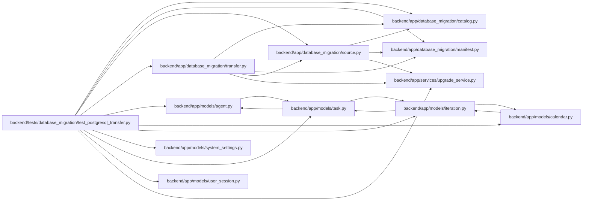

# test_postgresql_transfer Module

**Path:** `backend/tests/database_migration/test_postgresql_transfer.py`

## Description

Real PostgreSQL loader and fail-closed reconciliation tests.

## Imports

| Source | Symbols |
|--------|---------|
| `__future__` | `annotations` |
| `app.database_migration` | `transfer` |
| `app.database_migration.catalog` | `transfer_order`, `transfer_tables` |
| `app.database_migration.manifest` | `write_document` |
| `app.database_migration.source` | `preflight_source`, `MigrationDataError` |
| `app.database_migration.transfer` | `load_snapshot`, `reconcile_snapshot`, `target_identifier` |
| `app.models.agent` | `AgentActor` |
| `app.models.calendar` | `Calendar` |
| `app.models.iteration` | `Iteration` |
| `app.models.system_settings` | `SystemSetting` |
| `app.models.task` | `Task` |
| `app.models.user_session` | `UserSession` |
| `app.services.upgrade_service` | `bootstrap_database_schema`, `database_configuration` |
| `concurrent.futures` | `ThreadPoolExecutor` |
| `cryptography.fernet` | `Fernet` |
| `datetime` | `UTC`, `datetime` |
| `json` | `json` |
| `os` | `os` |
| `pathlib` | `Path` |
| `pytest` | `pytest` |
| `sqlalchemy` | `create_engine`, `func`, `select`, `text` |
| `sqlalchemy.engine` | `Connection` |
| `sqlalchemy.orm` | `Session` |
| `subprocess` | `subprocess` |
| `sys` | `sys` |
| `threading` | `Event`, `current_thread` |
| `typing` | `Any` |

## Local dependency map

<!-- Auto-generated local dependency summary. Do not edit by hand. -->

### Internal neighbors

| Direction | Module |
|---|---|
| Outbound | [catalog](../modules/catalog.md) |
| Outbound | [database_migration_manifest](../modules/database_migration_manifest.md) |
| Outbound | [source](../modules/source.md) |
| Outbound | [transfer](../modules/transfer.md) |
| Outbound | [models_agent](../modules/models_agent.md) |
| Outbound | [models_calendar](../modules/models_calendar.md) |
| Outbound | [models_iteration](../modules/models_iteration.md) |
| Outbound | [models_system_settings](../modules/models_system_settings.md) |
| Outbound | [models_task](../modules/models_task.md) |
| Outbound | [user_session](../modules/user_session.md) |
| Outbound | [upgrade_service](../modules/upgrade_service.md) |

### External packages

| Language | Used packages | Undeclared packages |
|---|---:|---:|
| python | 3 | 1 |

## Functions

| Function | Signature | Decorators | Description |
|----------|-----------|------------|-------------|
| `_source_artifacts` | `(tmp_path: Path, configure_database) -> tuple[Path, Path, str]` | — | — |
| `test_loader_rejects_concurrent_attempt_for_the_same_target` | `(tmp_path: Path, postgres_database, configure_database, monkeypatch: pytest.MonkeyPatch) -> None` | `@pytest.mark.postgresql`, `@pytest.mark.integration`, `@pytest.mark.allow_network` | — |
| `test_loader_is_idempotent_and_gate_opens_only_after_final_reconciliation` | `(tmp_path: Path, postgres_database, configure_database) -> None` | `@pytest.mark.postgresql`, `@pytest.mark.integration`, `@pytest.mark.allow_network` | — |
