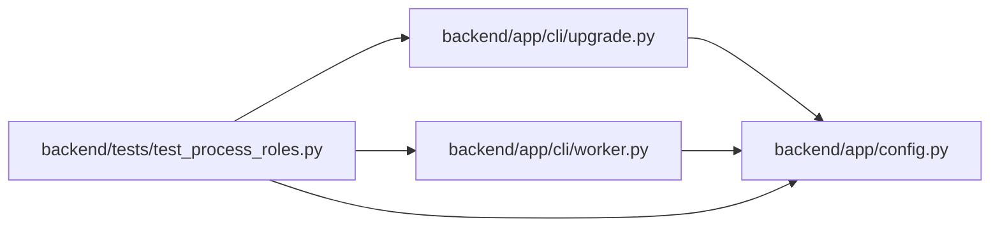

# test_process_roles Module

**Path:** `backend/tests/test_process_roles.py`

## Description

DBM-WORK-001 command ownership and process-role tests.

## Imports

| Source | Symbols |
|--------|---------|
| `__future__` | `annotations` |
| `app.cli` | `upgrade`, `worker` |
| `app.config` | `get_settings` |
| `pytest` | `pytest` |
| `types` | `SimpleNamespace` |

## Local dependency map

<!-- Auto-generated local dependency summary. Do not edit by hand. -->

### Internal neighbors

| Direction | Module |
|---|---|
| Outbound | [upgrade](../modules/upgrade.md) |
| Outbound | [worker](../modules/worker.md) |
| Outbound | [config](../modules/config.md) |

### External packages

| Language | Used packages | Undeclared packages |
|---|---:|---:|
| python | 1 | 1 |

## Functions

| Function | Signature | Decorators | Description |
|----------|-----------|------------|-------------|
| `clear_settings_cache` | `() -> None` | `@pytest.fixture(autouse=True)` | — |
| `_environment` | `(monkeypatch: pytest.MonkeyPatch, role: str) -> None` | — | — |
| `test_schema_command_rejects_web_role` | `(monkeypatch: pytest.MonkeyPatch) -> None` | — | — |
| `test_migration_command_cannot_bundle_repairs` | `(monkeypatch: pytest.MonkeyPatch) -> None` | — | — |
| `test_migration_and_repair_commands_have_disjoint_roles` | `(monkeypatch: pytest.MonkeyPatch) -> None` | — | — |
| `test_worker_is_drained_without_opening_database_in_fenced_mode` | *(async)* `(monkeypatch: pytest.MonkeyPatch) -> None` | `@pytest.mark.asyncio` | — |
