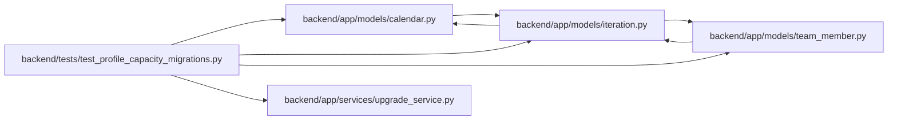

# test_profile_capacity_migrations Module

**Path:** `backend/tests/test_profile_capacity_migrations.py`

## Description

Preserve legacy absence identities and report conflicting person calendars.

## Imports

| Source | Symbols |
|--------|---------|
| `alembic` | `command` |
| `app.models.calendar` | `Calendar` |
| `app.models.iteration` | `Iteration` |
| `app.models.team_member` | `TeamMember`, `TeamMemberProfile`, `Vacation` |
| `app.services.upgrade_service` | `alembic_config` |
| `datetime` | `date` |
| `pytest` | `pytest` |
| `sqlalchemy` | `MetaData`, `Table`, `create_engine`, `select` |
| `sqlalchemy.engine` | `make_url` |

## Local dependency map

<!-- Auto-generated local dependency summary. Do not edit by hand. -->

### Internal neighbors

| Direction | Module |
|---|---|
| Outbound | [models_calendar](../modules/models_calendar.md) |
| Outbound | [models_iteration](../modules/models_iteration.md) |
| Outbound | [team_member](../modules/team_member.md) |
| Outbound | [upgrade_service](../modules/upgrade_service.md) |

### External packages

| Language | Used packages | Undeclared packages |
|---|---:|---:|
| python | 3 | 1 |

## Functions

| Function | Signature | Decorators | Description |
|----------|-----------|------------|-------------|
| `test_legacy_backfill_retains_ids_deduplicates_and_reports_conflict` | `(dialect, request, tmp_path, configure_database)` | `@pytest.mark.parametrize('dialect', [pytest.param('sqlite', marks=pytest.mark.sqlite), pytest.param('postgresql', marks=[pytest.mark.postgresql, pytest.mark.allow_network])])` | — |
