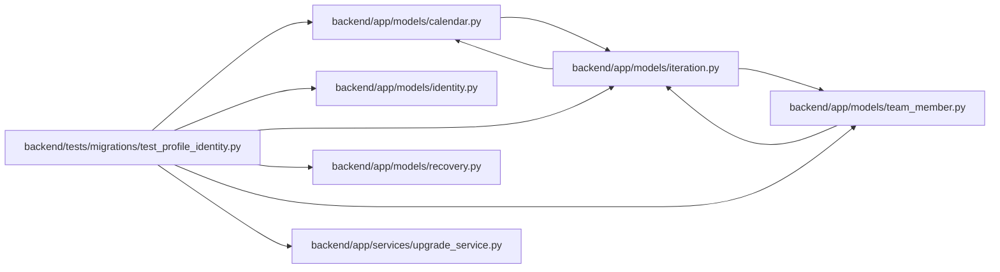

# test_profile_identity Module

**Path:** `backend/tests/migrations/test_profile_identity.py`

## Description

Person lifetime migration retains history and never rewinds numeric identities.

## Imports

| Source | Symbols |
|--------|---------|
| `alembic` | `command` |
| `app.models.calendar` | `Calendar` |
| `app.models.identity` | `Principal`, `CommandAudit` |
| `app.models.iteration` | `Iteration` |
| `app.models.recovery` | `ApplicationSnapshot` |
| `app.models.team_member` | `TeamMemberProfile` |
| `app.services.upgrade_service` | `alembic_config` |
| `datetime` | `UTC`, `datetime`, `date` |
| `pytest` | `pytest` |
| `sqlalchemy` | `create_engine`, `MetaData`, `Table`, `select` |
| `sqlalchemy.engine` | `make_url` |
| `uuid` | `UUID` |

## Local dependency map

<!-- Auto-generated local dependency summary. Do not edit by hand. -->

### Internal neighbors

| Direction | Module |
|---|---|
| Outbound | [models_calendar](../modules/models_calendar.md) |
| Outbound | [models_identity](../modules/models_identity.md) |
| Outbound | [models_iteration](../modules/models_iteration.md) |
| Outbound | [recovery](../modules/recovery.md) |
| Outbound | [team_member](../modules/team_member.md) |
| Outbound | [upgrade_service](../modules/upgrade_service.md) |

### External packages

| Language | Used packages | Undeclared packages |
|---|---:|---:|
| python | 3 | 1 |

## Functions

| Function | Signature | Decorators | Description |
|----------|-----------|------------|-------------|
| `test_profile_history_floor_lifetime_backfill_and_nonreuse` | `(dialect, request, tmp_path, configure_database)` | `@pytest.mark.parametrize('dialect', [pytest.param('sqlite', marks=pytest.mark.sqlite), pytest.param('postgresql', marks=[pytest.mark.postgresql, pytest.mark.allow_network])])` | — |
