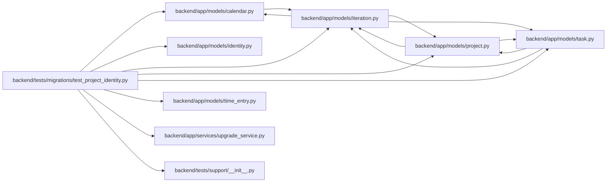

# test_project_identity Module

**Path:** `backend/tests/migrations/test_project_identity.py`

## Description

Project allocation floors, dependent preservation and transactional rebuilds.

## Imports

| Source | Symbols |
|--------|---------|
| `alembic` | `command` |
| `app.models.calendar` | `Calendar` |
| `app.models.identity` | `CommandAudit`, `Principal`, `ProjectMembership` |
| `app.models.iteration` | `Iteration` |
| `app.models.project` | `Project` |
| `app.models.task` | `Task` |
| `app.models.time_entry` | `TimeEntry`, `TimeEntryRevision` |
| `app.services.upgrade_service` | `alembic_config`, `run_alembic_upgrade` |
| `datetime` | `UTC`, `datetime` |
| `pytest` | `pytest` |
| `sqlalchemy` | `create_engine`, `event`, `text` |
| `sqlalchemy.engine` | `Engine` |
| `sqlite3` | `sqlite3` |
| `tests.support` | `schema_snapshot` |
| `uuid` | `uuid4` |

## Local dependency map

<!-- Auto-generated local dependency summary. Do not edit by hand. -->

### Internal neighbors

| Direction | Module |
|---|---|
| Outbound | [models_calendar](../modules/models_calendar.md) |
| Outbound | [models_identity](../modules/models_identity.md) |
| Outbound | [models_iteration](../modules/models_iteration.md) |
| Outbound | [models_project](../modules/models_project.md) |
| Outbound | [models_task](../modules/models_task.md) |
| Outbound | [models_time_entry](../modules/models_time_entry.md) |
| Outbound | [upgrade_service](../modules/upgrade_service.md) |
| Outbound | [support___init__](../modules/support___init__.md) |

### External packages

| Language | Used packages | Undeclared packages |
|---|---:|---:|
| python | 3 | 1 |

## Functions

| Function | Signature | Decorators | Description |
|----------|-----------|------------|-------------|
| `legacy_store` | `(tmp_path, configure_database)` | — | — |
| `retained_entry` | `(db, project_id)` | — | — |
| `seed_dependents` | `(db)` | — | — |
| `database_rows` | `(engine)` | — | — |
| `test_upgrade_preserves_dependents_and_retained_allocation_floor` | `(tmp_path, configure_database, empty_projects)` | `@pytest.mark.sqlite`, `@pytest.mark.parametrize('empty_projects', [False, True])` | — |
| `test_failed_rebuild_rolls_back_schema_and_all_dependent_rows` | `(tmp_path, configure_database, failure_point)` | `@pytest.mark.sqlite`, `@pytest.mark.parametrize('failure_point', ['drop table projects', 'create index ix_projects_status'])` | — |
| `test_direct_upgrade_preserves_enabled_foreign_keys` | `(tmp_path, configure_database)` | `@pytest.mark.sqlite` | — |
| `test_direct_upgrade_refuses_to_commit_a_callers_pending_writes` | `(tmp_path, configure_database)` | `@pytest.mark.sqlite` | — |
