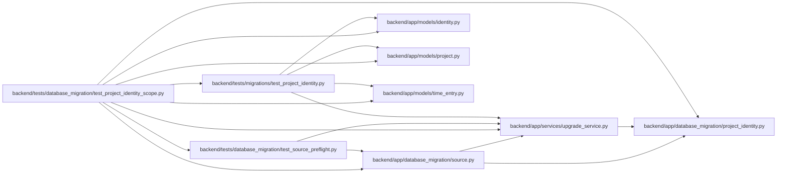

# test_project_identity_scope Module

**Path:** `backend/tests/database_migration/test_project_identity_scope.py`

## Description

Ambiguous legacy identities stop before writes and never expose private records.

## Imports

| Source | Symbols |
|--------|---------|
| `app.database_migration.project_identity` | `ProjectIdentityError`, `inspect_project_identity` |
| `app.database_migration.source` | `MigrationDataError`, `preflight_source` |
| `app.models.identity` | `CommandAudit` |
| `app.models.project` | `Project` |
| `app.models.time_entry` | `TimeEntry`, `TimeEntryRevision` |
| `app.services.upgrade_service` | `UpgradeError`, `run_alembic_upgrade` |
| `datetime` | `UTC`, `datetime` |
| `json` | `json` |
| `pytest` | `pytest` |
| `sqlalchemy` | `event` |
| `sqlalchemy.engine` | `Engine` |
| `tests.database_migration.test_source_preflight` | `_drain_evidence` |
| `tests.migrations.test_project_identity` | `legacy_store`, `retained_entry`, `seed_dependents` |

## Local dependency map

<!-- Auto-generated local dependency summary. Do not edit by hand. -->

### Internal neighbors

| Direction | Module |
|---|---|
| Outbound | [project_identity](../modules/project_identity.md) |
| Outbound | [source](../modules/source.md) |
| Outbound | [models_identity](../modules/models_identity.md) |
| Outbound | [models_project](../modules/models_project.md) |
| Outbound | [models_time_entry](../modules/models_time_entry.md) |
| Outbound | [upgrade_service](../modules/upgrade_service.md) |
| Outbound | [test_source_preflight](../modules/test_source_preflight.md) |
| Outbound | [test_project_identity](../modules/test_project_identity.md) |

### External packages

| Language | Used packages | Undeclared packages |
|---|---:|---:|
| python | 2 | 1 |

## Functions

| Function | Signature | Decorators | Description |
|----------|-----------|------------|-------------|
| `test_ambiguous_retained_scope_blocks_upgrade_and_snapshot_before_writes` | `(tmp_path, configure_database, name)` | `@pytest.mark.sqlite`, `@pytest.mark.parametrize('name', ['Same display name', 'Different display name'])` | — |
| `test_collision_diagnostics_are_bounded_and_do_not_include_notes` | `(tmp_path, configure_database)` | `@pytest.mark.sqlite` | — |
| `test_incomplete_history_scan_fails_closed_without_mutation` | `(tmp_path, configure_database)` | `@pytest.mark.sqlite` | — |
