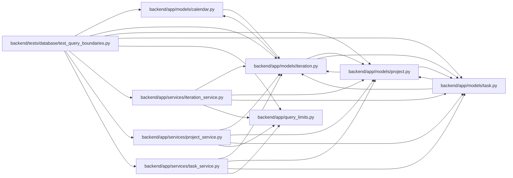

# test_query_boundaries Module

**Path:** `backend/tests/database/test_query_boundaries.py`

## Description

DBM-PERF-001 bounded graph and aggregate-summary tests.

## Imports

| Source | Symbols |
|--------|---------|
| `__future__` | `annotations` |
| `app.models.calendar` | `Calendar` |
| `app.models.iteration` | `Iteration` |
| `app.models.project` | `Project`, `ProjectMilestone` |
| `app.models.task` | `Task` |
| `app.query_limits` | `CollectionLimitExceededError` |
| `app.services.iteration_service` | `IterationService` |
| `app.services.project_service` | `ProjectService` |
| `app.services.task_service` | `TaskService` |
| `datetime` | `date` |
| `pytest` | `pytest` |
| `sqlalchemy` | `event`, `insert`, `select` |
| `sqlalchemy.ext.asyncio` | `AsyncEngine`, `AsyncSession`, `async_sessionmaker` |
| `typing` | `Any` |

## Local dependency map

<!-- Auto-generated local dependency summary. Do not edit by hand. -->

### Internal neighbors

| Direction | Module |
|---|---|
| Outbound | [models_calendar](../modules/models_calendar.md) |
| Outbound | [models_iteration](../modules/models_iteration.md) |
| Outbound | [models_project](../modules/models_project.md) |
| Outbound | [models_task](../modules/models_task.md) |
| Outbound | [query_limits](../modules/query_limits.md) |
| Outbound | [iteration_service](../modules/iteration_service.md) |
| Outbound | [project_service](../modules/project_service.md) |
| Outbound | [task_service](../modules/task_service.md) |

### External packages

| Language | Used packages | Undeclared packages |
|---|---:|---:|
| python | 2 | 1 |

## Functions

| Function | Signature | Decorators | Description |
|----------|-----------|------------|-------------|
| `_workspace_seed` | *(async)* `(db: AsyncSession, *, project_count: int = 1) -> tuple[int, int]` | — | — |
| `_insert_tasks` | *(async)* `(db: AsyncSession, *, iteration_id: int, project_id: int, start: int, count: int) -> None` | — | — |
| `test_iteration_tree_refuses_max_plus_one_without_truncation` | *(async)* `(db_session: AsyncSession) -> None` | `@pytest.mark.sqlite`, `@pytest.mark.asyncio` | — |
| `test_project_tree_and_list_refuse_max_plus_one` | *(async)* `(db_session: AsyncSession, monkeypatch: pytest.MonkeyPatch) -> None` | `@pytest.mark.sqlite`, `@pytest.mark.asyncio` | — |
| `test_iteration_list_uses_stable_explicit_keyset_pages` | *(async)* `(db_session: AsyncSession, monkeypatch: pytest.MonkeyPatch) -> None` | `@pytest.mark.sqlite`, `@pytest.mark.asyncio` | — |
| `test_iteration_summary_aggregates_without_loading_task_objects` | *(async)* `(db_session: AsyncSession) -> None` | `@pytest.mark.sqlite`, `@pytest.mark.asyncio` | — |
| `test_planning_readiness_summary_stays_compact_and_leaf_aware` | *(async)* `(db_session: AsyncSession) -> None` | `@pytest.mark.sqlite`, `@pytest.mark.asyncio` | — |
| `_summary_query_count` | *(async)* `(factory: async_sessionmaker[AsyncSession], engine: AsyncEngine, project_id: int) -> tuple[int, int, bool]` | — | — |
| `_portfolio_summary_query_count` | *(async)* `(factory: async_sessionmaker[AsyncSession], engine: AsyncEngine) -> tuple[int, int, int, bool]` | — | — |
| `test_project_portfolio_summaries_use_two_queries_at_portfolio_scale` | *(async)* `(db_session_factory: async_sessionmaker[AsyncSession], sqlite_engine: AsyncEngine) -> None` | `@pytest.mark.sqlite`, `@pytest.mark.asyncio` | — |
| `test_portfolio_milestones_traverse_stable_bounded_cursor_pages` | *(async)* `(db_session: AsyncSession) -> None` | `@pytest.mark.sqlite`, `@pytest.mark.asyncio` | — |
| `test_project_summary_query_count_and_identity_map_are_cardinality_constant` | *(async)* `(db_session_factory: async_sessionmaker[AsyncSession], sqlite_engine: AsyncEngine) -> None` | `@pytest.mark.sqlite`, `@pytest.mark.asyncio` | — |
