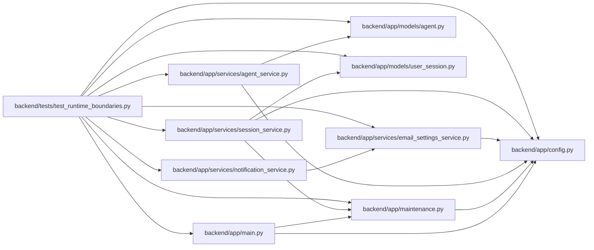

# test_runtime_boundaries Module

**Path:** `backend/tests/test_runtime_boundaries.py`

## Description

DBM-PERF-002 and DBM-MAINT-001 runtime-boundary tests.

## Imports

| Source | Symbols |
|--------|---------|
| `__future__` | `annotations` |
| `app.config` | `get_settings` |
| `app.main` | `app` |
| `app.maintenance` | `MaintenanceModeError`, `RuntimeBoundaryMiddleware`, `enforce_mcp_access`, `scope_requirement_is_mutating` |
| `app.models.agent` | `AgentActor` |
| `app.models.user_session` | `UserSession` |
| `app.services.agent_service` | `AgentService`, `hash_api_key` |
| `app.services.email_settings_service` | `EmailSettings` |
| `app.services.notification_service` | `NotificationService` |
| `app.services.session_service` | `_token_digest`, `get_or_create_session` |
| `ast` | `ast` |
| `datetime` | `UTC`, `datetime`, `timedelta` |
| `fastapi` | `FastAPI` |
| `fastapi.routing` | `APIRoute` |
| `json` | `json` |
| `pathlib` | `Path` |
| `pytest` | `pytest` |
| `typing` | `Any` |

## Local dependency map

<!-- Auto-generated local dependency summary. Do not edit by hand. -->

### Internal neighbors

| Direction | Module |
|---|---|
| Outbound | [config](../modules/config.md) |
| Outbound | [app_main](../modules/app_main.md) |
| Outbound | [maintenance](../modules/maintenance.md) |
| Outbound | [models_agent](../modules/models_agent.md) |
| Outbound | [user_session](../modules/user_session.md) |
| Outbound | [agent_service](../modules/agent_service.md) |
| Outbound | [email_settings_service](../modules/email_settings_service.md) |
| Outbound | [notification_service](../modules/notification_service.md) |
| Outbound | [session_service](../modules/session_service.md) |

### External packages

| Language | Used packages | Undeclared packages |
|---|---:|---:|
| python | 2 | 1 |

## Classes

| Class | Line | Bases | Description |
|-------|------|-------|-------------|
| [ScalarResult](../entities/ScalarResult.md) | 36 | — | — |
| [SessionDouble](../entities/SessionDouble.md) | 44 | — | — |
| [ProviderSessionDouble](../entities/ProviderSessionDouble.md) | 373 | — | — |

## Functions

| Function | Signature | Decorators | Description |
|----------|-----------|------------|-------------|
| `clear_runtime_settings_cache` | `() -> Any` | `@pytest.fixture(autouse=True)` | — |
| `_configure_mode` | `(monkeypatch: pytest.MonkeyPatch, mode: str) -> None` | — | — |
| `_asgi_request` | *(async)* `(app: Any, method: str, path: str) -> tuple[int, dict[str, str], bytes]` | — | — |
| `_boundary_app` | `() -> FastAPI` | — | — |
| `test_validation_only_is_exact_allowlist_and_fail_closed` | *(async)* `(monkeypatch: pytest.MonkeyPatch) -> None` | `@pytest.mark.asyncio` | — |
| `test_read_only_maintenance_allows_reads_but_rejects_every_new_write` | *(async)* `(monkeypatch: pytest.MonkeyPatch) -> None` | `@pytest.mark.asyncio` | — |
| `test_mcp_scope_contract_fences_mutations_and_preserves_read_tools` | `(monkeypatch: pytest.MonkeyPatch) -> None` | — | — |
| `test_application_has_one_fail_closed_boundary_for_all_rest_mutations` | `() -> None` | — | — |
| `test_every_mcp_tool_uses_scope_classification_and_mutators_are_write_only` | `() -> None` | — | — |
| `test_active_browser_reads_skip_session_commits` | *(async)* `(monkeypatch: pytest.MonkeyPatch) -> None` | `@pytest.mark.asyncio` | — |
| `test_validation_session_resolution_has_no_hidden_touch` | *(async)* `(monkeypatch: pytest.MonkeyPatch) -> None` | `@pytest.mark.asyncio` | — |
| `test_validation_agent_authentication_has_no_hidden_last_seen_write` | *(async)* `(monkeypatch: pytest.MonkeyPatch) -> None` | `@pytest.mark.asyncio` | — |
| `test_smtp_provider_wait_starts_after_database_release` | *(async)* `(monkeypatch: pytest.MonkeyPatch) -> None` | `@pytest.mark.asyncio` | — |
