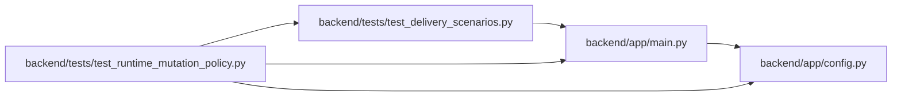

# test_runtime_mutation_policy Module

**Path:** `backend/tests/test_runtime_mutation_policy.py`

## Description

Runtime configuration preserves supplied conflicts in either rollout mode.

## Imports

| Source | Symbols |
|--------|---------|
| `app.config` | `get_settings` |
| `app.main` | `app` |
| `httpx` | `httpx` |
| `tests.test_delivery_scenarios` | `delivery_store` |

## Local dependency map

<!-- Auto-generated local dependency summary. Do not edit by hand. -->

### Internal neighbors

| Direction | Module |
|---|---|
| Outbound | [config](../modules/config.md) |
| Outbound | [app_main](../modules/app_main.md) |
| Outbound | [test_delivery_scenarios](../modules/test_delivery_scenarios.md) |

### External packages

| Language | Used packages | Undeclared packages |
|---|---:|---:|
| python | 1 | 0 |

## Functions

| Function | Signature | Decorators | Description |
|----------|-----------|------------|-------------|
| `test_effective_policy_and_compatibility_conflicts` | *(async)* `(delivery_store)` | — | — |
