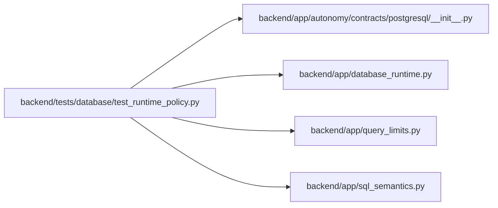

# test_runtime_policy Module

**Path:** `backend/tests/database/test_runtime_policy.py`

## Description

DBM-RUN-002/003 retry, ordering, and comparison contract tests.

## Imports

| Source | Symbols |
|--------|---------|
| `__future__` | `annotations` |
| `app.autonomy.contracts.postgresql` | `load_postgresql_contract_bundle` |
| `app.database_runtime` | `DatabaseConflictError`, `DatabaseFailureKind`, `DatabaseRetryPolicy`, `classify_database_failure`, `run_database_retry` |
| `app.query_limits` | `MAX_BOUNDED_LIST_ITEMS`, `MAX_ITERATION_TREE_TASKS` |
| `app.sql_semantics` | `portable_contains` |
| `pytest` | `pytest` |
| `sqlalchemy` | `Column`, `Integer`, `MetaData`, `String`, `Table`, `create_engine`, `select` |

## Local dependency map

<!-- Auto-generated local dependency summary. Do not edit by hand. -->

### Internal neighbors

| Direction | Module |
|---|---|
| Outbound | [postgresql___init__](../modules/postgresql___init__.md) |
| Outbound | [database_runtime](../modules/database_runtime.md) |
| Outbound | [query_limits](../modules/query_limits.md) |
| Outbound | [sql_semantics](../modules/sql_semantics.md) |

### External packages

| Language | Used packages | Undeclared packages |
|---|---:|---:|
| python | 2 | 1 |

## Classes

| Class | Line | Bases | Description |
|-------|------|-------|-------------|
| [SqlStateFailure](../entities/SqlStateFailure.md) | 23 | `RuntimeError` | Minimal Psycopg-shaped fault used without a database server. |

## Functions

| Function | Signature | Decorators | Description |
|----------|-----------|------------|-------------|
| `test_retry_classifier_uses_sqlstate_not_messages` | `(sqlstate: str, kind: DatabaseFailureKind) -> None` | `@pytest.mark.parametrize(('sqlstate', 'kind'), [('40001', DatabaseFailureKind.SERIALIZATION), ('40P01', DatabaseFailureKind.DEADLOCK), ('08006', DatabaseFailureKind.CONNECTION), ('57P01', DatabaseFailureKind.CONNECTION)])` | — |
| `test_safe_transaction_recovers_within_bounded_attempts` | *(async)* `() -> None` | `@pytest.mark.asyncio` | — |
| `test_unsafe_transaction_is_never_replayed` | *(async)* `() -> None` | `@pytest.mark.asyncio` | — |
| `test_retry_after_durable_command_record_does_not_duplicate_effect` | *(async)* `() -> None` | `@pytest.mark.asyncio` | — |
| `_completed_sleep` | *(async)* `() -> None` | — | — |
| `test_retry_deadline_and_attempt_storm_are_bounded` | *(async)* `() -> None` | `@pytest.mark.asyncio` | — |
| `test_ascii_unicode_null_and_tie_ordering_golden_case` | `() -> None` | — | — |
| `test_response_bounds_match_the_approved_capacity_contract` | `() -> None` | — | — |
