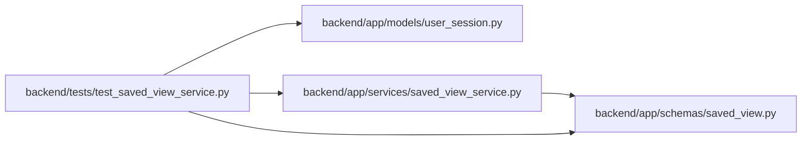

# test_saved_view_service Module

**Path:** `backend/tests/test_saved_view_service.py`

## Description

Saved-view task filter normalization and matching behavior.

## Imports

| Source | Symbols |
|--------|---------|
| `app.models.user_session` | `UserSession` |
| `app.schemas.saved_view` | `SavedViewCreateRequest`, `SavedViewType` |
| `app.services.saved_view_service` | `SavedViewService` |
| `math` | `nan` |
| `pytest` | `pytest` |
| `sqlalchemy.ext.asyncio` | `AsyncSession` |
| `types` | `SimpleNamespace` |
| `typing` | `Any`, `cast` |

## Local dependency map

<!-- Auto-generated local dependency summary. Do not edit by hand. -->

### Internal neighbors

| Direction | Module |
|---|---|
| Outbound | [user_session](../modules/user_session.md) |
| Outbound | [schemas_saved_view](../modules/schemas_saved_view.md) |
| Outbound | [saved_view_service](../modules/saved_view_service.md) |

### External packages

| Language | Used packages | Undeclared packages |
|---|---:|---:|
| python | 2 | 1 |

## Functions

| Function | Signature | Decorators | Description |
|----------|-----------|------------|-------------|
| `service_without_database` | `() -> SavedViewService` | — | — |
| `task_response` | `(*, assignee: Any = None, effort_days: Any = 1, is_deferred: bool = False, is_composite: bool = False, children: list[Any] \| None = None) -> SimpleNamespace` | — | — |
| `test_task_planning_issue_filter_normalizes_supported_values` | `(planning_issue: str \| None) -> None` | `@pytest.mark.parametrize('planning_issue', [None, 'unassigned', 'missing-effort', 'any'])` | — |
| `test_task_planning_issue_filter_rejects_unknown_values` | `(planning_issue: Any) -> None` | `@pytest.mark.parametrize('planning_issue', ['', 'missing_effort', 'UNASSIGNED', True, ['unassigned']])` | — |
| `test_task_planning_issue_filter_persists_in_saved_view` | *(async)* `(db_session: AsyncSession) -> None` | `@pytest.mark.asyncio` | — |
| `test_task_planning_issue_matching_uses_planning_leaf_semantics` | `() -> None` | — | — |
| `test_task_planning_issue_filter_preserves_matching_child_context` | `() -> None` | — | — |
