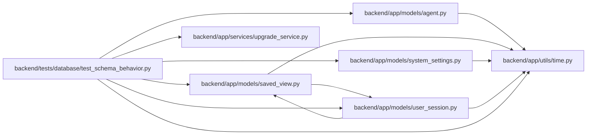

# test_schema_behavior Module

**Path:** `backend/tests/database/test_schema_behavior.py`

## Description

Dual-dialect Boolean/JSON/time/constraint/RETURNING behavior matrix.

## Imports

| Source | Symbols |
|--------|---------|
| `__future__` | `annotations` |
| `app.models.agent` | `AgentActor` |
| `app.models.saved_view` | `SavedView` |
| `app.models.system_settings` | `SystemSetting` |
| `app.models.user_session` | `UserSession` |
| `app.services.upgrade_service` | `bootstrap_database_schema` |
| `app.utils.time` | `utc_now` |
| `cryptography.fernet` | `Fernet` |
| `datetime` | `UTC`, `datetime` |
| `pathlib` | `Path` |
| `pytest` | `pytest` |
| `sqlalchemy` | `create_engine`, `event`, `insert`, `inspect`, `select` |
| `sqlalchemy.exc` | `IntegrityError` |
| `sqlalchemy.orm` | `Session` |
| `sqlalchemy.pool` | `NullPool` |

## Local dependency map

<!-- Auto-generated local dependency summary. Do not edit by hand. -->

### Internal neighbors

| Direction | Module |
|---|---|
| Outbound | [models_agent](../modules/models_agent.md) |
| Outbound | [models_saved_view](../modules/models_saved_view.md) |
| Outbound | [models_system_settings](../modules/models_system_settings.md) |
| Outbound | [user_session](../modules/user_session.md) |
| Outbound | [upgrade_service](../modules/upgrade_service.md) |
| Outbound | [time](../modules/time.md) |

### External packages

| Language | Used packages | Undeclared packages |
|---|---:|---:|
| python | 3 | 1 |

## Functions

| Function | Signature | Decorators | Description |
|----------|-----------|------------|-------------|
| `behavior_engine` | `(database_url: str, *, sqlite: bool)` | — | — |
| `exercise_schema_behavior` | `(engine) -> None` | — | — |
| `test_sqlite_schema_behavior_matrix` | `(tmp_path: Path, configure_database) -> None` | `@pytest.mark.sqlite` | — |
| `test_postgresql_schema_behavior_matrix` | `(postgres_database, configure_database) -> None` | `@pytest.mark.postgresql`, `@pytest.mark.integration`, `@pytest.mark.allow_network` | — |
