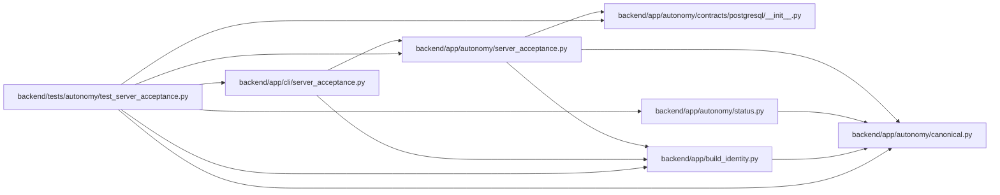

# test_server_acceptance Module

**Path:** `backend/tests/autonomy/test_server_acceptance.py`

## Description

Self-hosted server acceptance contract and adapter tests.

## Imports

| Source | Symbols |
|--------|---------|
| `__future__` | `annotations` |
| `app.autonomy.canonical` | `canonical_json_bytes`, `sha256_hex` |
| `app.autonomy.contracts.postgresql` | `load_postgresql_contract_bundle` |
| `app.autonomy.server_acceptance` | `ApplicationAcceptance`, `CasAcceptance`, `LockedAcceptanceObject`, `ObjectStoreAcceptance`, `OpenBaoTransitClient`, `S3ObjectLockClient`, `ServerAcceptanceCandidate`, `ServerAcceptanceConfig`, `ServerAcceptanceError`, `ServerAcceptanceReceipt`, `TransitSignerAcceptance`, `ValkeyCasClient`, `_read_resp`, `_signed_report_payload`, `build_blocked_result`, `run_server_acceptance`, `verify_receipt_current_build`, `verify_receipt_trusted_signer` |
| `app.autonomy.status` | `ResolvedStatusEvidence` |
| `app.build_identity` | `BackendBuildIdentity`, `load_backend_build_identity`, `package_artifact_digest` |
| `app.cli.server_acceptance` | `_emit`, `main` |
| `base64` | `base64` |
| `cryptography.hazmat.primitives` | `serialization` |
| `cryptography.hazmat.primitives.asymmetric.ed25519` | `Ed25519PrivateKey` |
| `datetime` | `UTC`, `datetime`, `timedelta` |
| `httpx` | `httpx` |
| `io` | `BytesIO` |
| `json` | `json` |
| `pydantic` | `ValidationError` |
| `pytest` | `pytest` |

## Local dependency map

<!-- Auto-generated local dependency summary. Do not edit by hand. -->

### Internal neighbors

| Direction | Module |
|---|---|
| Outbound | [autonomy_canonical](../modules/autonomy_canonical.md) |
| Outbound | [postgresql___init__](../modules/postgresql___init__.md) |
| Outbound | [autonomy_server_acceptance](../modules/autonomy_server_acceptance.md) |
| Outbound | [status](../modules/status.md) |
| Outbound | [build_identity](../modules/build_identity.md) |
| Outbound | [cli_server_acceptance](../modules/cli_server_acceptance.md) |

### External packages

| Language | Used packages | Undeclared packages |
|---|---:|---:|
| python | 4 | 1 |

## Functions

| Function | Signature | Decorators | Description |
|----------|-----------|------------|-------------|
| `_build_identity` | `() -> BackendBuildIdentity` | — | — |
| `_signature` | `(payload: bytes, *, version: int = 2) -> str` | — | — |
| `_candidate` | `() -> ServerAcceptanceCandidate` | — | — |
| `_receipt` | `() -> ServerAcceptanceReceipt` | — | — |
| `test_server_receipt_is_nonproduction_and_cannot_enter_status_evidence` | `() -> None` | — | — |
| `test_receipt_round_trips_through_offline_cli_verification` | `(tmp_path, capsys, monkeypatch) -> None` | — | — |
| `test_offline_verification_rejects_untrusted_embedded_signer` | `(tmp_path, capsys, monkeypatch) -> None` | — | — |
| `test_receipt_output_is_atomically_host_readable` | `(tmp_path, capsys) -> None` | — | — |
| `test_baked_build_identity_hashes_stable_package_members` | `(tmp_path) -> None` | — | — |
| `test_receipt_verification_rejects_expiry_and_different_build` | `() -> None` | — | — |
| `test_receipt_rejects_different_locked_object_location` | `() -> None` | — | — |
| `test_blocked_result_is_digest_bound_and_preserves_boundary` | `() -> None` | — | — |
| `test_server_acceptance_rejects_production_before_network_access` | `() -> None` | — | — |
| `test_server_acceptance_success_path_seals_final_receipt` | `(monkeypatch) -> None` | — | — |
| `test_openbao_transit_requires_nonexportable_key_and_verifies_signature` | `() -> None` | — | — |
| `test_minio_adapter_proves_locked_exact_version_survives_delete` | `() -> None` | — | — |
| `test_valkey_probe_uses_independent_writer_and_confirms_aof` | `(monkeypatch) -> None` | — | — |
| `test_resp_parser_handles_acceptance_reply_shapes` | `(wire: bytes, expected: object) -> None` | `@pytest.mark.parametrize(('wire', 'expected'), [(b'+PONG\r\n', 'PONG'), (b'$5\r\nvalue\r\n', b'value'), (b'$-1\r\n', None), (b':2\r\n', 2)])` | — |
