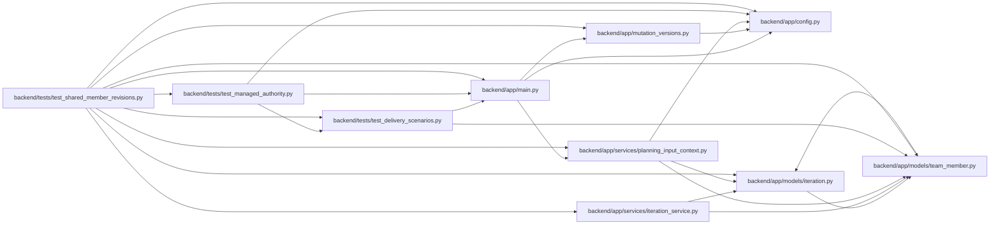

# test_shared_member_revisions Module

**Path:** `backend/tests/test_shared_member_revisions.py`

## Description

Shared-input scopes and destructive writes retain initial aggregate guards.

## Imports

| Source | Symbols |
|--------|---------|
| `app.config` | `get_settings` |
| `app.main` | `app`, `app` |
| `app.models.iteration` | `Iteration` |
| `app.models.team_member` | `TeamMember` |
| `app.mutation_versions` | `MissingMutationRevision` |
| `app.services.iteration_service` | `IterationService` |
| `app.services.planning_input_context` | `observe_planning_input` |
| `datetime` | `date` |
| `httpx` | `httpx`, `httpx` |
| `json` | `json`, `json` |
| `pytest` | `pytest` |
| `sqlalchemy` | `select` |
| `tests.test_delivery_scenarios` | `delivery_store` |
| `tests.test_managed_authority` | `managed_store` |

## Local dependency map

<!-- Auto-generated local dependency summary. Do not edit by hand. -->

### Internal neighbors

| Direction | Module |
|---|---|
| Outbound | [config](../modules/config.md) |
| Outbound | [app_main](../modules/app_main.md) |
| Outbound | [models_iteration](../modules/models_iteration.md) |
| Outbound | [team_member](../modules/team_member.md) |
| Outbound | [mutation_versions](../modules/mutation_versions.md) |
| Outbound | [iteration_service](../modules/iteration_service.md) |
| Outbound | [planning_input_context](../modules/planning_input_context.md) |
| Outbound | [test_delivery_scenarios](../modules/test_delivery_scenarios.md) |
| Outbound | [test_managed_authority](../modules/test_managed_authority.md) |

### External packages

| Language | Used packages | Undeclared packages |
|---|---:|---:|
| python | 3 | 1 |

## Functions

| Function | Signature | Decorators | Description |
|----------|-----------|------------|-------------|
| `test_shared_member_initial_map_covers_other_allocations` | *(async)* `(delivery_store)` | — | — |
| `test_iteration_delete_requires_observed_revision` | *(async)* `(delivery_store, monkeypatch)` | — | — |
| `test_vacation_preview_and_nested_import_retain_complete_shared_map` | *(async)* `(delivery_store, monkeypatch)` | — | — |
| `test_json_import_preview_is_strict_atomic_and_retains_stale_conflict` | *(async)* `(managed_store, monkeypatch)` | — | — |
