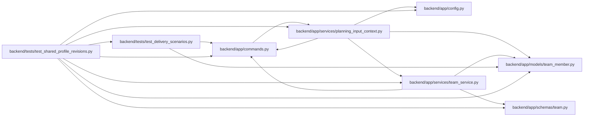

# test_shared_profile_revisions Module

**Path:** `backend/tests/test_shared_profile_revisions.py`

## Description

Profile skill writes retain initial complete planning observations.

## Imports

| Source | Symbols |
|--------|---------|
| `app.commands` | `AggregateVersionConflict`, `PlanningConflict` |
| `app.config` | `get_settings` |
| `app.models.team_member` | `TeamMemberProfileSkill` |
| `app.schemas.team` | `TeamMemberProfileSkillCreate` |
| `app.services.planning_input_context` | `observe_planning_input` |
| `app.services.team_service` | `TeamService` |
| `pytest` | `pytest` |
| `sqlalchemy` | `func`, `select` |
| `tests.test_delivery_scenarios` | `delivery_store` |

## Local dependency map

<!-- Auto-generated local dependency summary. Do not edit by hand. -->

### Internal neighbors

| Direction | Module |
|---|---|
| Outbound | [commands](../modules/commands.md) |
| Outbound | [config](../modules/config.md) |
| Outbound | [team_member](../modules/team_member.md) |
| Outbound | [schemas_team](../modules/schemas_team.md) |
| Outbound | [planning_input_context](../modules/planning_input_context.md) |
| Outbound | [team_service](../modules/team_service.md) |
| Outbound | [test_delivery_scenarios](../modules/test_delivery_scenarios.md) |

### External packages

| Language | Used packages | Undeclared packages |
|---|---:|---:|
| python | 2 | 1 |

## Functions

| Function | Signature | Decorators | Description |
|----------|-----------|------------|-------------|
| `test_skill_create_uses_initial_profile_map_and_exposes_current_skill_resource` | *(async)* `(delivery_store, monkeypatch)` | — | — |
| `test_skill_context_does_not_silently_truncate_large_profiles` | *(async)* `(delivery_store)` | — | — |
