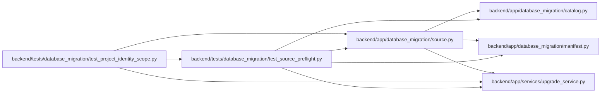

# test_source_preflight Module

**Path:** `backend/tests/database_migration/test_source_preflight.py`

## Description

Read-only SQLite snapshot and manifest safety tests.

## Imports

| Source | Symbols |
|--------|---------|
| `__future__` | `annotations` |
| `app.database_migration.catalog` | `transfer_tables` |
| `app.database_migration.manifest` | `verify_document`, `write_document` |
| `app.database_migration.source` | `MigrationDataError`, `preflight_source` |
| `app.services.upgrade_service` | `bootstrap_database_schema`, `head_revision` |
| `datetime` | `UTC`, `datetime`, `timedelta` |
| `json` | `json` |
| `pathlib` | `Path` |
| `pytest` | `pytest` |
| `sqlite3` | `sqlite3` |

## Local dependency map

<!-- Auto-generated local dependency summary. Do not edit by hand. -->

### Internal neighbors

| Direction | Module |
|---|---|
| Inbound | [test_project_identity_scope](../modules/test_project_identity_scope.md) |
| Outbound | [catalog](../modules/catalog.md) |
| Outbound | [database_migration_manifest](../modules/database_migration_manifest.md) |
| Outbound | [source](../modules/source.md) |
| Outbound | [upgrade_service](../modules/upgrade_service.md) |

### External packages

| Language | Used packages | Undeclared packages |
|---|---:|---:|
| python | 1 | 1 |

## Functions

| Function | Signature | Decorators | Description |
|----------|-----------|------------|-------------|
| `_drain_evidence` | `(path: Path, *, captured_at: datetime \| None = None) -> Path` | — | — |
| `_current_source` | `(path: Path, configure_database) -> Path` | — | — |
| `_seed_task_graph` | `(connection: sqlite3.Connection) -> None` | — | — |
| `test_preflight_creates_deterministic_secret_free_manifest` | `(tmp_path: Path, configure_database) -> None` | `@pytest.mark.sqlite` | — |
| `test_preflight_refuses_invalid_boolean_before_target_mutation` | `(tmp_path: Path, configure_database) -> None` | `@pytest.mark.sqlite` | — |
| `test_preflight_refuses_values_that_postgresql_varchar_cannot_store` | `(tmp_path: Path, configure_database) -> None` | `@pytest.mark.sqlite` | — |
| `test_preflight_refuses_corrupt_sqlite_source` | `(tmp_path: Path, configure_database) -> None` | `@pytest.mark.sqlite` | — |
| `test_preflight_refuses_orphans_and_malformed_text_json` | `(tmp_path: Path, configure_database) -> None` | `@pytest.mark.sqlite` | — |
| `test_preflight_refuses_stale_revision_and_live_writer_claim` | `(tmp_path: Path, configure_database) -> None` | `@pytest.mark.sqlite` | — |
| `test_preflight_refuses_partial_unique_duplicates_and_task_cycles` | `(tmp_path: Path, configure_database) -> None` | `@pytest.mark.sqlite` | — |
| `test_preflight_refuses_stale_or_unfenced_writer_evidence` | `(tmp_path: Path, configure_database) -> None` | `@pytest.mark.sqlite` | — |
| `test_preflight_refuses_target_owned_source_state` | `(tmp_path: Path, configure_database) -> None` | `@pytest.mark.sqlite` | — |
