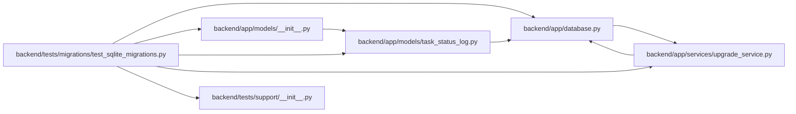

# test_sqlite_migrations Module

**Path:** `backend/tests/migrations/test_sqlite_migrations.py`

## Description

SQLite side of the fresh/legacy/inspection migration matrix.

## Imports

| Source | Symbols |
|--------|---------|
| `__future__` | `annotations` |
| `alembic` | `command` |
| `app` | `models` |
| `app.database` | `Base` |
| `app.models.task_status_log` | `TaskStatusLog` |
| `app.services.upgrade_service` | `LEGACY_BASELINE_REVISION`, `UpgradeError`, `alembic_config`, `assert_database_current`, `bootstrap_database_schema`, `head_revision`, `inspect_database`, `run_alembic_upgrade` |
| `datetime` | `UTC` |
| `pathlib` | `Path` |
| `pytest` | `pytest` |
| `sqlalchemy` | `create_engine`, `inspect`, `select`, `text` |
| `sqlalchemy.orm` | `Session` |
| `sqlite3` | `sqlite3` |
| `tests.support` | `schema_snapshot` |

## Local dependency map

<!-- Auto-generated local dependency summary. Do not edit by hand. -->

### Internal neighbors

| Direction | Module |
|---|---|
| Outbound | [app_database](../modules/app_database.md) |
| Outbound | [models___init__](../modules/models___init__.md) |
| Outbound | [task_status_log](../modules/task_status_log.md) |
| Outbound | [upgrade_service](../modules/upgrade_service.md) |
| Outbound | [support___init__](../modules/support___init__.md) |

### External packages

| Language | Used packages | Undeclared packages |
|---|---:|---:|
| python | 3 | 1 |

## Functions

| Function | Signature | Decorators | Description |
|----------|-----------|------------|-------------|
| `sqlite_url` | `(path: Path) -> str` | — | — |
| `seed_legacy_baseline` | `(database_path: Path) -> None` | — | — |
| `test_single_head_invariant` | `() -> None` | — | — |
| `test_schema_only_bootstrap_is_current_and_data_empty` | `(tmp_path: Path, configure_database) -> None` | `@pytest.mark.sqlite` | — |
| `test_representative_legacy_sqlite_upgrades_with_explicit_semantics` | `(tmp_path: Path, configure_database) -> None` | `@pytest.mark.sqlite` | — |
| `test_live_schema_column_contract_matches_model_metadata` | `(tmp_path: Path, configure_database) -> None` | `@pytest.mark.sqlite` | — |
| `test_unknown_nonempty_schema_is_refused` | `(tmp_path: Path, configure_database) -> None` | `@pytest.mark.sqlite` | — |
| `test_unknown_alembic_revision_is_refused` | `(tmp_path: Path, configure_database) -> None` | `@pytest.mark.sqlite` | — |
| `test_startup_assertion_refuses_stale_schema_without_mutation` | `(tmp_path: Path, configure_database) -> None` | `@pytest.mark.sqlite` | — |
| `test_target_alignment_revision_supports_reviewed_downgrade` | `(tmp_path: Path, configure_database) -> None` | `@pytest.mark.sqlite` | — |
| `test_alembic_config_preserves_percent_encoded_values` | `(configure_database) -> None` | — | — |
