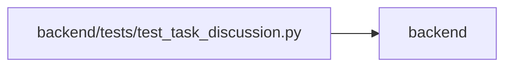

# test_task_discussion Module

**Path:** `backend/tests/test_task_discussion.py`

## Description

Discussion is attributable, versioned, private and independent from execution.

## Imports

| Source | Symbols |
|--------|---------|
| `app.authority` | `Authority`, `AuthorityError`, `internal_authority` |
| `app.commands` | `PlanningConflict`, `command_transaction` |
| `app.config` | `get_settings` |
| `app.models.capacity` | `PlanningState` |
| `app.models.discussion` | `InboxNotification`, `TaskCommentRevision`, `TaskComment` |
| `app.models.identity` | `ProjectMembership` |
| `app.models.outbound_webhook` | `OutboundWebhookDelivery` |
| `app.models.task` | `Task` |
| `app.schemas.task` | `TaskCreate` |
| `app.services.backlog_snapshot_service` | `BacklogSnapshotService` |
| `app.services.discussion_service` | `DiscussionService` |
| `app.services.outbound_webhook_service` | `OutboundWebhookService` |
| `app.services.task_service` | `TaskService` |
| `app.utils.time` | `utc_now` |
| `dataclasses` | `replace` |
| `datetime` | `timedelta` |
| `pytest` | `pytest` |
| `sqlalchemy` | `delete`, `select`, `update` |
| `sqlalchemy.sql.dml` | `Update` |
| `tests.test_delivery_scenarios` | `delivery_store` |
| `tests.test_task_domain` | `human_context` |

## Local dependency map

<!-- Auto-generated local dependency summary. Do not edit by hand. -->

> Module-level dependencies exceed the generated-diagram limits, so the diagram and table below group them by top-level package. Counts report the number of module neighbors in each package.

### Internal neighbors

| Direction | Module |
|---|---|
| Outbound | `backend` (16) |

### External packages

| Language | Used packages | Undeclared packages |
|---|---:|---:|
| python | 2 | 1 |

> All 16 module neighbor(s) are summarized by package because the module-level view exceeds the 12-node limit.

## Functions

| Function | Signature | Decorators | Description |
|----------|-----------|------------|-------------|
| `context` | *(async)* `(db, scenario, monkeypatch)` | — | — |
| `test_comment_versions_preserve_execution_and_history` | *(async)* `(delivery_store, monkeypatch)` | — | — |
| `test_comment_authority_mentions_and_tombstone` | *(async)* `(delivery_store, monkeypatch)` | — | — |
| `test_worker_rechecks_unsubscribe_or_revocation` | *(async)* `(delivery_store, monkeypatch, revoke)` | `@pytest.mark.parametrize('revoke', [False, True])` | — |
| `test_inbox_retry_idempotency_and_read_state_are_separate` | *(async)* `(delivery_store, monkeypatch)` | — | — |
| `test_delivery_failure_is_bounded_and_retry_does_not_duplicate_receipts` | *(async)* `(delivery_store, monkeypatch)` | — | — |
| `test_comment_rechecks_task_scope_after_acquiring_its_write_lock` | *(async)* `(delivery_store, monkeypatch)` | — | — |
| `test_discussion_history_reappears_with_the_restored_task_identity` | *(async)* `(delivery_store, monkeypatch)` | — | — |
