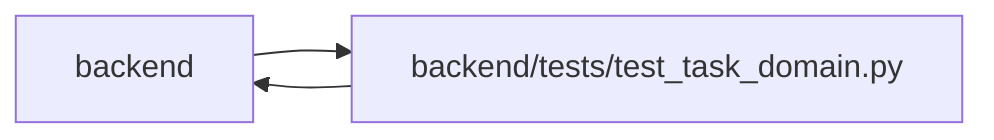

# test_task_domain Module

**Path:** `backend/tests/test_task_domain.py`

## Description

Domain commands preserve identity, evidence independence and bounded read contracts.

## Imports

| Source | Symbols |
|--------|---------|
| `app` | `mcp_agent_tools` |
| `app.authority` | `Authority`, `AuthorityError` |
| `app.commands` | `command_transaction` |
| `app.main` | `app`, `app` |
| `app.models.agent` | `AgentRun`, `AgentTaskAssignment`, `AgentActor`, `AgentActor`, `AgentRun`, `AgentTaskAssignment` |
| `app.models.identity` | `Principal`, `PrincipalProfileLink`, `ProjectMembership` |
| `app.models.task` | `Task` |
| `app.models.task_brief` | `TaskBriefRevision`, `TaskProgressRecord`, `TaskReviewRecord` |
| `app.models.team_member` | `TeamMemberProfile` |
| `app.schemas.agent` | `AgentWorkSubmit`, `AgentReviewVerdict` |
| `app.schemas.task` | `TaskCreate`, `TaskUpdate` |
| `app.schemas.task_brief` | `BriefConvert`, `BriefWrite`, `TaskBrief`, `BriefCriterion`, `ProgressWrite`, `CriterionProgress`, `TaskReviewWrite` |
| `app.schemas.task_domain` | `TaskActionRequest` |
| `app.schemas.triage` | `TriageItemCreate`, `TriageItemResponse`, `TriageConvertToBacklogRequest` |
| `app.services.agent_work_service` | `AgentWorkService` |
| `app.services.backlog_snapshot_service` | `BacklogSnapshotService` |
| `app.services.identity_service` | `IdentityService` |
| `app.services.task_brief_service` | `TaskBriefService`, `import_legacy_brief`, `render_brief` |
| `app.services.task_detail_service` | `TaskDetailService` |
| `app.services.task_domain_service` | `TaskDomainService`, `normalize_effort` |
| `app.services.task_service` | `TaskService`, `TaskVersionConflictError` |
| `app.services.triage_service` | `TriageService` |
| `app.services.work_metrics` | `aggregate_metrics` |
| `app.utils.time` | `utc_now`, `utc_now` |
| `dataclasses` | `replace` |
| `datetime` | `timedelta`, `timedelta` |
| `httpx` | `httpx`, `httpx` |
| `json` | `json` |
| `pytest` | `pytest` |
| `sqlalchemy` | `func`, `select` |
| `tests.test_delivery_scenarios` | `delivery_store` |

## Local dependency map

<!-- Auto-generated local dependency summary. Do not edit by hand. -->

> Module-level dependencies exceed the generated-diagram limits, so the diagram and table below group them by top-level package. Counts report the number of module neighbors in each package.

### Internal neighbors

| Direction | Module |
|---|---|
| Inbound | `backend` (5) |
| Outbound | `backend` (25) |

### External packages

| Language | Used packages | Undeclared packages |
|---|---:|---:|
| python | 3 | 1 |

> All 30 module neighbor(s) are summarized by package because the module-level view exceeds the 12-node limit.

## Functions

| Function | Signature | Decorators | Description |
|----------|-----------|------------|-------------|
| `human_context` | *(async)* `(db, project_id)` | — | — |
| `test_backlog_manual_execution_independent_review_and_reopen` | *(async)* `(delivery_store)` | — | — |
| `test_owner_and_ids_survive_commit_uncommit` | *(async)* `(delivery_store)` | — | — |
| `test_estimates_preserve_unknown_zero_and_nominal_day` | `()` | — | — |
| `test_legacy_brief_conversion_is_stable_and_does_not_accept_checkmarks` | `()` | — | — |
| `test_criteria_keep_identity_and_explicit_revisions` | *(async)* `(delivery_store)` | — | — |
| `test_bounded_detail_does_not_populate_execution_children` | *(async)* `(delivery_store)` | — | — |
| `test_backlog_recovery_keeps_ids_and_append_only_brief_history` | *(async)* `(delivery_store)` | — | — |
| `test_cancel_requires_current_execution_ownership_and_invalidates_fence` | *(async)* `(delivery_store)` | — | — |
| `test_shared_actions_rest_mcp_and_explicit_backlog_triage` | *(async)* `(delivery_store)` | — | — |
| `test_rework_requires_fresh_progress_and_preserves_prior_evidence` | *(async)* `(delivery_store)` | — | — |
| `test_triage_handoff_preserves_canonical_fields_and_criterion_ids` | *(async)* `(delivery_store)` | — | — |
| `test_managed_assigned_submission_and_independent_rework` | *(async)* `(delivery_store)` | — | — |
| `test_progress_availability_matches_open_leaf_execution_permission` | *(async)* `(delivery_store)` | — | — |
| `test_current_review_does_not_depend_on_first_history_page` | *(async)* `(delivery_store)` | — | — |
