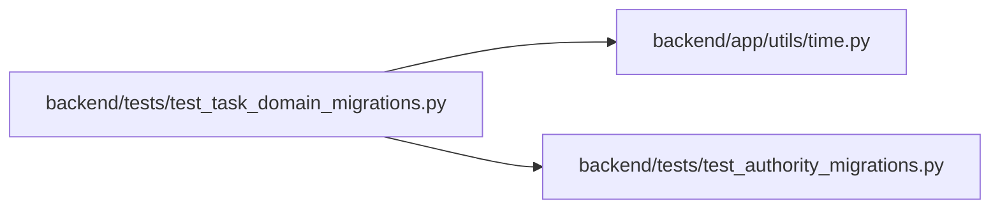

# test_task_domain_migrations Module

**Path:** `backend/tests/test_task_domain_migrations.py`

## Description

Initial task-domain constraints, evidence retention and identity fences.

## Imports

| Source | Symbols |
|--------|---------|
| `alembic` | `command` |
| `app.utils.time` | `utc_now` |
| `datetime` | `date` |
| `pytest` | `pytest` |
| `sqlalchemy` | `Boolean`, `Date`, `DateTime`, `Float`, `Integer`, `JSON`, `MetaData`, `select`, `inspect` |
| `sqlalchemy.exc` | `IntegrityError` |
| `tests.test_authority_migrations` | `initial_database` |

## Local dependency map

<!-- Auto-generated local dependency summary. Do not edit by hand. -->

### Internal neighbors

| Direction | Module |
|---|---|
| Outbound | [time](../modules/time.md) |
| Outbound | [test_authority_migrations](../modules/test_authority_migrations.md) |

### External packages

| Language | Used packages | Undeclared packages |
|---|---:|---:|
| python | 3 | 1 |

## Functions

| Function | Signature | Decorators | Description |
|----------|-----------|------------|-------------|
| `insert_fixture` | `(connection, table, **values)` | — | Fill required scalar data while every relationship remains explicitly supplied. |
| `test_deletion_fence_survives_without_tasks` | `(initial_database)` | — | — |
| `test_initial_schema_enforces_scope_and_retains_deleted_task_evidence` | `(initial_database)` | — | — |
