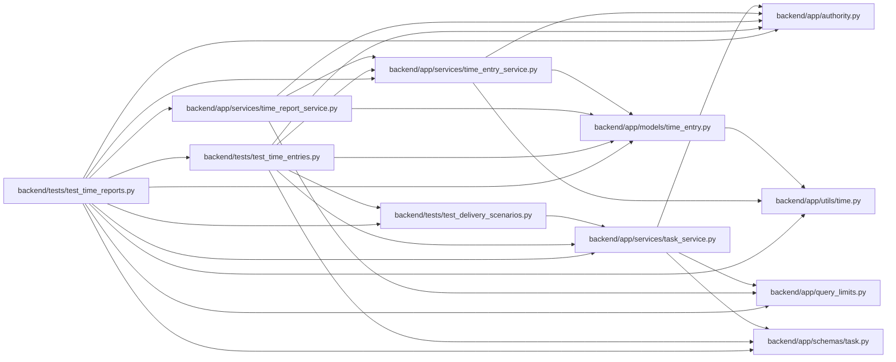

# test_time_reports Module

**Path:** `backend/tests/test_time_reports.py`

## Description

Recorded coverage and manager totals preserve private entry boundaries.

## Imports

| Source | Symbols |
|--------|---------|
| `app.authority` | `Authority`, `AuthorityError` |
| `app.models.time_entry` | `TimeEntry` |
| `app.query_limits` | `CollectionLimitExceededError` |
| `app.schemas.task` | `TaskCreate`, `TaskUpdate` |
| `app.services.task_service` | `TaskService` |
| `app.services.time_entry_service` | `TimeEntryService` |
| `app.services.time_report_service` | `TimeReportService` |
| `app.utils.time` | `utc_now` |
| `datetime` | `date`, `timedelta` |
| `pytest` | `pytest` |
| `sqlalchemy` | `insert` |
| `tests.test_delivery_scenarios` | `delivery_store` |
| `tests.test_time_entries` | `prepare`, `entry_data`, `isolated_time_settings` |
| `uuid` | `uuid4` |

## Local dependency map

<!-- Auto-generated local dependency summary. Do not edit by hand. -->

### Internal neighbors

| Direction | Module |
|---|---|
| Outbound | [authority](../modules/authority.md) |
| Outbound | [models_time_entry](../modules/models_time_entry.md) |
| Outbound | [query_limits](../modules/query_limits.md) |
| Outbound | [schemas_task](../modules/schemas_task.md) |
| Outbound | [task_service](../modules/task_service.md) |
| Outbound | [time_entry_service](../modules/time_entry_service.md) |
| Outbound | [time_report_service](../modules/time_report_service.md) |
| Outbound | [time](../modules/time.md) |
| Outbound | [test_delivery_scenarios](../modules/test_delivery_scenarios.md) |
| Outbound | [test_time_entries](../modules/test_time_entries.md) |

### External packages

| Language | Used packages | Undeclared packages |
|---|---:|---:|
| python | 2 | 1 |

## Functions

| Function | Signature | Decorators | Description |
|----------|-----------|------------|-------------|
| `test_personal_and_manager_totals_do_not_expose_private_records` | *(async)* `(delivery_store, monkeypatch)` | — | — |
| `test_unknown_time_zero_estimates_project_work_and_finite_pages` | *(async)* `(delivery_store, monkeypatch)` | — | — |
| `test_moved_task_keeps_original_scope_and_does_not_expose_new_title` | *(async)* `(delivery_store, monkeypatch)` | — | — |
| `test_csv_rejects_spreadsheet_formula_interpretation_without_manufacturing_missing_values` | `()` | — | — |
| `test_personal_export_bound_is_explicit` | *(async)* `(delivery_store, monkeypatch)` | — | — |
