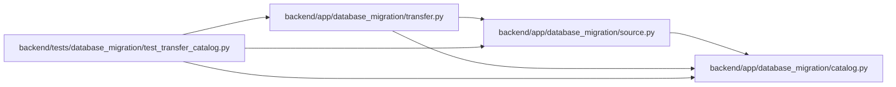

# test_transfer_catalog Module

**Path:** `backend/tests/database_migration/test_transfer_catalog.py`

## Description

Versioned transfer catalog invariants.

## Imports

| Source | Symbols |
|--------|---------|
| `__future__` | `annotations` |
| `app.database_migration.catalog` | `TARGET_OWNED_TABLES`, `application_tables`, `catalog_entries`, `staged_reference_columns`, `transfer_order`, `transfer_tables` |
| `app.database_migration.source` | `MigrationDataError` |
| `app.database_migration.transfer` | `_source_sequence_floors` |
| `hashlib` | `hashlib` |
| `pytest` | `pytest` |
| `sqlite3` | `sqlite3` |

## Local dependency map

<!-- Auto-generated local dependency summary. Do not edit by hand. -->

### Internal neighbors

| Direction | Module |
|---|---|
| Outbound | [catalog](../modules/catalog.md) |
| Outbound | [source](../modules/source.md) |
| Outbound | [transfer](../modules/transfer.md) |

### External packages

| Language | Used packages | Undeclared packages |
|---|---:|---:|
| python | 1 | 1 |

## Functions

| Function | Signature | Decorators | Description |
|----------|-----------|------------|-------------|
| `test_catalog_disposes_every_packaged_table_exactly_once` | `() -> None` | — | — |
| `test_nullable_cycles_are_staged_without_weakening_required_foreign_keys` | `() -> None` | — | — |
| `test_source_allocation_reader_refuses_corrupt_sequence_metadata_without_writes` | `(tmp_path, fault)` | `@pytest.mark.parametrize('fault', ['negative', 'noninteger', 'duplicate'])` | — |
