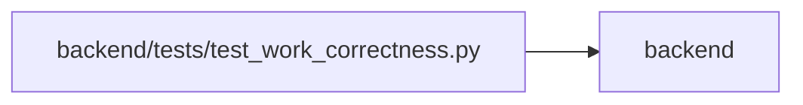

# test_work_correctness Module

**Path:** `backend/tests/test_work_correctness.py`

## Description

Atomic recovery, hierarchy, aggregate versions and cross-surface metric contracts.

## Imports

| Source | Symbols |
|--------|---------|
| `app.authority` | `Authority` |
| `app.commands` | `command_transaction` |
| `app.config` | `get_settings` |
| `app.main` | `app` |
| `app.models.agent` | `AgentActor`, `AgentIdempotencyRecord` |
| `app.models.identity` | `Principal` |
| `app.models.iteration` | `Iteration` |
| `app.models.recovery` | `ApplicationSnapshot`, `TaskScheduleBaseline` |
| `app.models.task` | `Task`, `TaskDependency` |
| `app.models.team_member` | `TeamMember`, `Vacation`, `TeamMember` |
| `app.schemas.agent_planning` | `AgentPlanningCommandContext` |
| `app.schemas.task` | `TaskUpdate`, `TaskCreate` |
| `app.services.agent_planning_service` | `AgentPlanningService` |
| `app.services.hierarchy_repair_service` | `HierarchyRepairService` |
| `app.services.iteration_service` | `IterationService` |
| `app.services.project_service` | `ProjectService` |
| `app.services.saved_view_service` | `SavedViewService` |
| `app.services.scheduler_service` | `SchedulerService` |
| `app.services.snapshot_service` | `SnapshotService` |
| `app.services.task_service` | `TaskService` |
| `app.services.work_metrics` | `aggregate_metrics`, `leaf_metrics`, `working_today` |
| `app.utils.time` | `utc_now` |
| `asyncio` | `asyncio` |
| `datetime` | `datetime`, `timezone`, `date` |
| `httpx` | `httpx` |
| `pytest` | `pytest` |
| `sqlalchemy` | `func`, `select`, `delete` |
| `tests.test_delivery_scenarios` | `delivery_store` |

## Local dependency map

<!-- Auto-generated local dependency summary. Do not edit by hand. -->

> Module-level dependencies exceed the generated-diagram limits, so the diagram and table below group them by top-level package. Counts report the number of module neighbors in each package.

### Internal neighbors

| Direction | Module |
|---|---|
| Outbound | `backend` (23) |

### External packages

| Language | Used packages | Undeclared packages |
|---|---:|---:|
| python | 3 | 1 |

> All 23 module neighbor(s) are summarized by package because the module-level view exceeds the 12-node limit.

## Functions

| Function | Signature | Decorators | Description |
|----------|-----------|------------|-------------|
| `test_merge_failure_preserves_every_task_and_recovery_point` | *(async)* `(delivery_store, monkeypatch)` | — | — |
| `test_merge_truth_and_leaf_totals_are_stable` | *(async)* `(delivery_store, states, expected)` | `@pytest.mark.parametrize(('states', 'expected'), [(('closed', 'closed'), 'closed'), (('resolved', 'closed'), 'resolved'), (('planned', 'active'), 'active')])` | — |
| `test_unmerge_preserves_child_ids_and_rejects_referenced_parent` | *(async)* `(delivery_store)` | — | — |
| `test_failed_command_cannot_evict_old_snapshots` | *(async)* `(delivery_store, monkeypatch)` | — | — |
| `test_preview_revision_rejects_apply_after_another_edit` | *(async)* `(delivery_store)` | — | — |
| `test_snapshot_survives_new_session_and_restores_ids_in_place` | *(async)* `(delivery_store)` | — | — |
| `test_project_iteration_and_portfolio_share_metric_definitions` | *(async)* `(delivery_store)` | — | — |
| `test_late_start_does_not_overwrite_committed_baseline` | *(async)* `(delivery_store)` | — | — |
| `test_repair_is_dry_by_default_and_does_not_invent_acceptance` | *(async)* `(delivery_store)` | — | — |
| `test_calendar_midnight_is_not_server_midnight` | `()` | — | — |
| `test_two_http_writers_cannot_overwrite_the_same_revision` | *(async)* `(delivery_store)` | — | — |
| `test_restore_recovers_dates_and_absences_without_inventing_acceptance` | *(async)* `(delivery_store)` | — | — |
| `test_saved_dashboard_counts_matching_leaves_across_hierarchy_changes` | *(async)* `(delivery_store)` | — | — |
| `test_rearrangement_preserves_accepted_leaves_and_inherited_facets` | *(async)* `(delivery_store)` | — | — |
| `test_agent_schedule_preview_is_transient_and_reports_input_versions` | *(async)* `(delivery_store)` | — | — |
| `test_bulk_preview_default_and_input_revisions_protect_apply` | *(async)* `(delivery_store)` | — | — |
