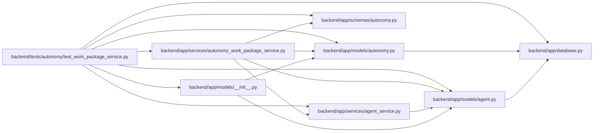

# test_work_package_service Module

**Path:** `backend/tests/autonomy/test_work_package_service.py`

## Description

Focused fenced verifier lifecycle integration tests.

## Imports

| Source | Symbols |
|--------|---------|
| `__future__` | `annotations` |
| `app` | `models` |
| `app.database` | `Base` |
| `app.models.agent` | `AgentActor` |
| `app.models.autonomy` | `AgentAutonomyTopology`, `AgentAutonomyTopologyMember` |
| `app.schemas.autonomy` | `AgentWorkPackageCreate`, `ResolvedVerifierLease`, `VerificationBeginRequest`, `VerificationClaimRequest`, `VerificationCriterionResult`, `VerificationRequirementCreate`, `VerificationSubmitRequest` |
| `app.services.agent_service` | `AgentConflictError`, `AgentPermissionError` |
| `app.services.autonomy_work_package_service` | `AutonomyWorkPackageService` |
| `datetime` | `UTC`, `datetime`, `timedelta` |
| `json` | `json` |
| `pytest` | `pytest` |
| `sqlalchemy.ext.asyncio` | `AsyncSession`, `async_sessionmaker`, `create_async_engine` |

## Local dependency map

<!-- Auto-generated local dependency summary. Do not edit by hand. -->

### Internal neighbors

| Direction | Module |
|---|---|
| Outbound | [app_database](../modules/app_database.md) |
| Outbound | [models___init__](../modules/models___init__.md) |
| Outbound | [models_agent](../modules/models_agent.md) |
| Outbound | [models_autonomy](../modules/models_autonomy.md) |
| Outbound | [schemas_autonomy](../modules/schemas_autonomy.md) |
| Outbound | [agent_service](../modules/agent_service.md) |
| Outbound | [autonomy_work_package_service](../modules/autonomy_work_package_service.md) |

### External packages

| Language | Used packages | Undeclared packages |
|---|---:|---:|
| python | 2 | 1 |

## Functions

| Function | Signature | Decorators | Description |
|----------|-----------|------------|-------------|
| `_actor` | `(name: str, role: str, scopes: list[str]) -> AgentActor` | — | — |
| `_lease` | `(*, action: str, actor: AgentActor, logical_key: str, slot: str, digest: str) -> ResolvedVerifierLease` | — | — |
| `test_multi_slot_verification_is_fenced_and_rejection_invalidates_sibling` | *(async)* `(tmp_path) -> None` | `@pytest.mark.sqlite`, `@pytest.mark.asyncio` | — |
