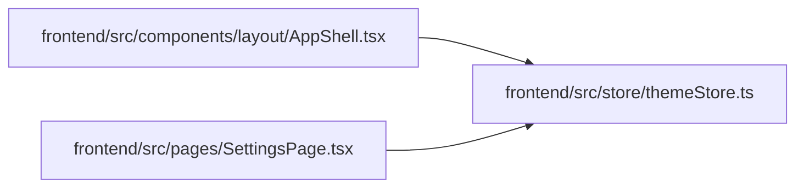

# themeStore Module

**Path:** `frontend/src/store/themeStore.ts`

## Description

_Auto-generated from `frontend/src/store/themeStore.ts`._

## Imports

| Source | Symbols |
|--------|---------|
| `zustand` | `create` |
| `zustand/middleware` | `persist` |

## Module Signals

| Signal | Values |
|--------|--------|
| Exports | `useThemeStore` |
| Constants | `useThemeStore` |
| Module calls | `useThemeStore = create<ThemeState>()` |

## Local dependency map

<!-- Auto-generated local dependency summary. Do not edit by hand. -->

### Internal neighbors

| Direction | Module |
|---|---|
| Inbound | [AppShell](../modules/AppShell.md) |
| Inbound | [SettingsPage](../modules/SettingsPage.md) |

### External packages

| Language | Used packages | Undeclared packages |
|---|---:|---:|
| typescript | 1 | 0 |

## Classes

| Class | Kind | Line | Bases / Target | Description |
|-------|------|------|----------------|-------------|
| [ThemeState](../entities/ThemeState.md) | Class | 6 | — | — |
| [Theme](../entities/Theme.md) | Type alias | 4 | — | — |
