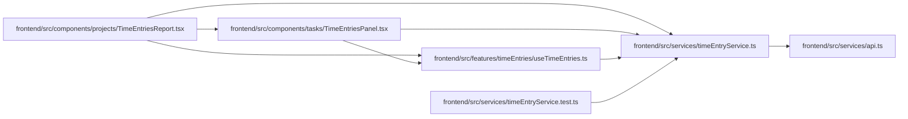

# timeEntryService Module

**Path:** `frontend/src/services/timeEntryService.ts`

## Description

_Auto-generated from `frontend/src/services/timeEntryService.ts`._

## Imports

| Source | Symbols |
|--------|---------|
| `./api` | `api` |

## Module Signals

| Signal | Values |
|--------|--------|
| Exports | `TimeEntry`, `TimeFilters`, `TimePage`, `TimeReport`, `TimeRevision`, `TimeValues`, `timeAccessDenied`, `timeEntryService` |
| Constants | `timeEntryService` |

## Local dependency map

<!-- Auto-generated local dependency summary. Do not edit by hand. -->

### Internal neighbors

| Direction | Module |
|---|---|
| Inbound | [TimeEntriesReport](../modules/TimeEntriesReport.md) |
| Inbound | [TimeEntriesPanel](../modules/TimeEntriesPanel.md) |
| Inbound | [useTimeEntries](../modules/useTimeEntries.md) |
| Inbound | [timeEntryService.test](../modules/timeEntryService.test.md) |
| Outbound | [api](../modules/api.md) |

## Classes

| Class | Kind | Line | Bases / Target | Description |
|-------|------|------|----------------|-------------|
| [TimeValues](../entities/timeEntryService_TimeValues.md) | Class | 3 | — | — |
| [TimeEntry](../entities/timeEntryService_TimeEntry.md) | Class | 4 | `TimeValues` | — |
| [TimePage](../entities/TimePage.md) | Class | 8 | — | — |
| [TimeRevision](../entities/TimeRevision.md) | Class | 9 | `TimeValues` | — |
| [TimeReport](../entities/TimeReport.md) | Class | 10 | — | — |
| [TimeFilters](../entities/TimeFilters.md) | Class | 18 | — | — |

## Functions

| Function | Signature | Decorators | Description |
|----------|-----------|------------|-------------|
| `timeAccessDenied` | `(error: unknown)` | — | — |
