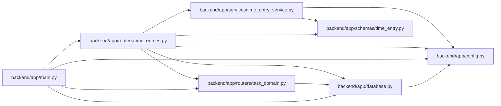

# time_entries Module

**Path:** `backend/app/routers/time_entries.py`

## Description

Optional human-authored time records with private correction history.

## Imports

| Source | Symbols |
|--------|---------|
| `app.config` | `get_settings` |
| `app.database` | `get_db` |
| `app.routers.task_domain` | `domain_result` |
| `app.schemas.time_entry` | `TimeEntryCreate`, `TimeEntryCorrection`, `TimeEntryVoid`, `TimeEntryResponse`, `TimeEntryPage`, `TimeRevisionPage`, `TimeEntryCapabilities` |
| `app.services.time_entry_service` | `TimeEntryService` |
| `datetime` | `date` |
| `fastapi` | `APIRouter`, `Depends`, `Query` |
| `sqlalchemy.ext.asyncio` | `AsyncSession` |
| `typing` | `Annotated` |

## Local dependency map

<!-- Auto-generated local dependency summary. Do not edit by hand. -->

### Internal neighbors

| Direction | Module |
|---|---|
| Inbound | [app_main](../modules/app_main.md) |
| Outbound | [config](../modules/config.md) |
| Outbound | [app_database](../modules/app_database.md) |
| Outbound | [routers_task_domain](../modules/routers_task_domain.md) |
| Outbound | [schemas_time_entry](../modules/schemas_time_entry.md) |
| Outbound | [time_entry_service](../modules/time_entry_service.md) |

### External packages

| Language | Used packages | Undeclared packages |
|---|---:|---:|
| python | 2 | 0 |

## Classes

| Class | Kind | Line | Bases / Target | Description |
|-------|------|------|----------------|-------------|
| [DB](../entities/time_entries_DB.md) | Type alias | 16 | `Annotated[AsyncSession, Depends(get_db, scope='function')]` | — |

## Functions

| Function | Signature | Decorators | Description |
|----------|-----------|------------|-------------|
| `capabilities` | *(async)* `(db: DB)` | `@router.get('/capabilities', response_model=TimeEntryCapabilities)` | — |
| `list_entries` | *(async)* `(db: DB, project_id: int \| None = Query(default=None, ge=1), task_id: int \| None = Query(default=None, ge=1), start: date \| None = None, end: date \| None = None, after_id: int = Query(default=0, ge=0), upper_id: int \| None = Query(default=None, ge=0), limit: int = Query(default=50, ge=1, le=100), include_voided: bool = False)` | `@router.get('', response_model=TimeEntryPage)` | — |
| `create_entry` | *(async)* `(data: TimeEntryCreate, db: DB)` | `@router.post('', response_model=TimeEntryResponse, status_code=201)` | — |
| `get_entry` | *(async)* `(entry_id: int, db: DB)` | `@router.get('/{entry_id}', response_model=TimeEntryResponse)` | — |
| `correct_entry` | *(async)* `(entry_id: int, data: TimeEntryCorrection, db: DB)` | `@router.put('/{entry_id}', response_model=TimeEntryResponse)` | — |
| `void_entry` | *(async)* `(entry_id: int, data: TimeEntryVoid, db: DB)` | `@router.post('/{entry_id}/void', response_model=TimeEntryResponse)` | — |
| `history` | *(async)* `(entry_id: int, db: DB, after_version: int = Query(default=0, ge=0), limit: int = Query(default=50, ge=1, le=100))` | `@router.get('/{entry_id}/history', response_model=TimeRevisionPage)` | — |
