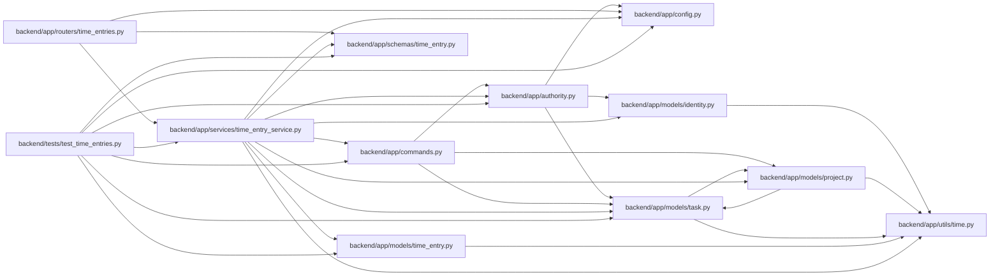

# time_entry_service Module

**Path:** `backend/app/services/time_entry_service.py`

## Description

Attributable minute commands with private reads and independent version history.

Human authors can read and correct only their own records with current access to the original recording project. Author-row locking serializes creation retries and daily totals across both dialects; UUID/digest replay returns the current record without adding minutes. Commands append private revisions atomically and never reserve task or planning revisions. Task/project associations survive deletion as stable recording-scope IDs; task snapshots do not rewind the ledger. The optional capability defaults disabled and agent/guest credentials cannot author records.

## Imports

| Source | Symbols |
|--------|---------|
| `app.authority` | `AuthorityError`, `internal_authority`, `require_project` |
| `app.commands` | `PlanningConflict`, `atomic_command` |
| `app.config` | `get_settings` |
| `app.models.identity` | `Principal` |
| `app.models.project` | `Project` |
| `app.models.task` | `Task` |
| `app.models.time_entry` | `TimeEntry`, `TimeEntryRevision` |
| `app.schemas.time_entry` | `TimeEntryResponse`, `TimeRevisionResponse` |
| `app.utils.time` | `utc_now` |
| `hashlib` | `hashlib` |
| `json` | `json` |
| `sqlalchemy` | `func`, `select`, `update` |
| `sqlalchemy.orm` | `raiseload` |

## Local dependency map

<!-- Auto-generated local dependency summary. Do not edit by hand. -->

### Internal neighbors

| Direction | Module |
|---|---|
| Inbound | [time_entries](../modules/time_entries.md) |
| Inbound | [test_time_entries](../modules/test_time_entries.md) |
| Outbound | [authority](../modules/authority.md) |
| Outbound | [commands](../modules/commands.md) |
| Outbound | [config](../modules/config.md) |
| Outbound | [models_identity](../modules/models_identity.md) |
| Outbound | [models_project](../modules/models_project.md) |
| Outbound | [models_task](../modules/models_task.md) |
| Outbound | [models_time_entry](../modules/models_time_entry.md) |
| Outbound | [schemas_time_entry](../modules/schemas_time_entry.md) |
| Outbound | [time](../modules/time.md) |

### External packages

| Language | Used packages | Undeclared packages |
|---|---:|---:|
| python | 1 | 0 |

## Classes

| Class | Line | Bases | Description |
|-------|------|-------|-------------|
| [TimeEntryVersionConflict](../entities/TimeEntryVersionConflict.md) | 20 | `PlanningConflict` | — |
| [TimeEntryService](../entities/TimeEntryService.md) | 29 | — | — |