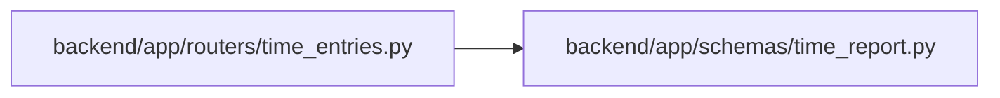

# time_report Module

**Path:** `backend/app/schemas/time_report.py`

## Description

Scoped recorded coverage, distinct from current effort estimates.

## Imports

| Source | Symbols |
|--------|---------|
| `datetime` | `date` |
| `pydantic` | `BaseModel` |
| `typing` | `Literal` |

## Local dependency map

<!-- Auto-generated local dependency summary. Do not edit by hand. -->

### Internal neighbors

| Direction | Module |
|---|---|
| Inbound | [time_entries](../modules/time_entries.md) |

### External packages

| Language | Used packages | Undeclared packages |
|---|---:|---:|
| python | 1 | 0 |

## Classes

| Class | Line | Bases | Description |
|-------|------|-------|-------------|
| [TimeReportItem](../entities/TimeReportItem.md) | 8 | `BaseModel` | — |
| [TimeReportTotals](../entities/TimeReportTotals.md) | 17 | `BaseModel` | — |
| [TimeReportPage](../entities/TimeReportPage.md) | 26 | `BaseModel` | — |
