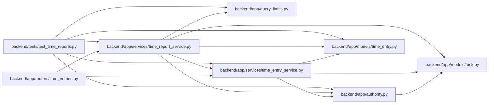

# time_report_service Module

**Path:** `backend/app/services/time_report_service.py`

## Description

Authorized scalar totals and exports without exposing other authors' records.

Personal reports default to the authenticated author's active records. Team totals require manager authority and select only scalar task/project aggregates; individual notes and revisions never enter that projection. The cohort includes current leaf work and retained historical associations, with unavailable estimates for moved/deleted/composite work. Missing recorded time stays null; zero estimates stay known. Finite ID pages carry independent live scope totals, and CSV exports reject more than 5,000 rows and neutralize formula prefixes in text. Individual exports remain author-only.

## Imports

| Source | Symbols |
|--------|---------|
| `app.authority` | `AuthorityError`, `internal_authority` |
| `app.models.task` | `Task` |
| `app.models.time_entry` | `TimeEntry` |
| `app.query_limits` | `CollectionLimitExceededError` |
| `app.services.time_entry_service` | `TimeEntryService` |
| `csv` | `csv` |
| `io` | `StringIO` |
| `sqlalchemy` | `and_`, `case`, `func`, `select`, `union` |
| `sqlalchemy.orm` | `aliased` |

## Local dependency map

<!-- Auto-generated local dependency summary. Do not edit by hand. -->

### Internal neighbors

| Direction | Module |
|---|---|
| Inbound | [time_entries](../modules/time_entries.md) |
| Inbound | [test_time_reports](../modules/test_time_reports.md) |
| Outbound | [authority](../modules/authority.md) |
| Outbound | [models_task](../modules/models_task.md) |
| Outbound | [models_time_entry](../modules/models_time_entry.md) |
| Outbound | [query_limits](../modules/query_limits.md) |
| Outbound | [time_entry_service](../modules/time_entry_service.md) |

### External packages

| Language | Used packages | Undeclared packages |
|---|---:|---:|
| python | 1 | 0 |

## Classes

| Class | Line | Bases | Description |
|-------|------|-------|-------------|
| [TimeReportService](../entities/TimeReportService.md) | 16 | — | — |
