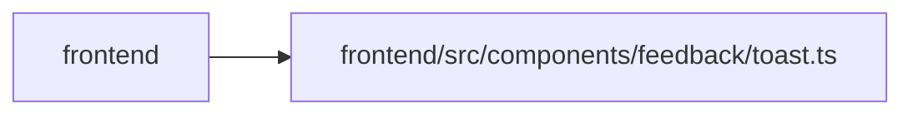

# toast Module

**Path:** `frontend/src/components/feedback/toast.ts`

## Description

_Auto-generated from `frontend/src/components/feedback/toast.ts`._

## Imports

| Source | Symbols |
|--------|---------|
| `react` | `createContext`, `useContext` |

## Module Signals

| Signal | Values |
|--------|--------|
| Exports | `ToastApi`, `ToastContext`, `ToastInput`, `ToastTone`, `ToneToastOptions`, `useToast` |
| Constants | `ToastContext` |
| Module calls | `ToastContext = createContext` |

## Local dependency map

<!-- Auto-generated local dependency summary. Do not edit by hand. -->

> Module-level dependencies exceed the generated-diagram limits, so the diagram and table below group them by top-level package. Counts report the number of module neighbors in each package.

### Internal neighbors

| Direction | Module |
|---|---|
| Inbound | `frontend` (18) |

### External packages

| Language | Used packages | Undeclared packages |
|---|---:|---:|
| typescript | 1 | 0 |

> All 18 module neighbor(s) are summarized by package because the module-level view exceeds the 12-node limit.

## Classes

| Class | Kind | Line | Bases / Target | Description |
|-------|------|------|----------------|-------------|
| [ToastInput](../entities/ToastInput.md) | Class | 5 | — | — |
| [ToastApi](../entities/ToastApi.md) | Class | 17 | — | — |
| [ToastTone](../entities/ToastTone.md) | Type alias | 3 | — | — |
| [ToneToastOptions](../entities/ToneToastOptions.md) | Type alias | 15 | — | — |

## Functions

| Function | Signature | Decorators | Description |
|----------|-----------|------------|-------------|
| `useToast` | `()` | — | — |
