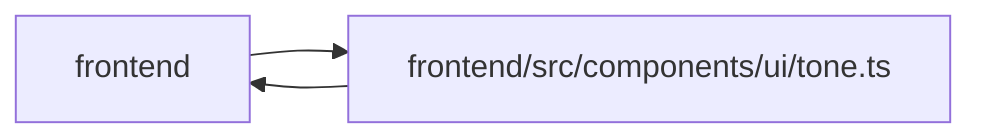

# tone Module

**Path:** `frontend/src/components/ui/tone.ts`

## Description

_Auto-generated from `frontend/src/components/ui/tone.ts`._

## Imports

| Source | Symbols |
|--------|---------|
| `../../types/task` | `TaskStatus` |

## Module Signals

| Signal | Values |
|--------|--------|
| Exports | `PillTone`, `STATUS_TONE`, `isTaskStatus`, `pillToneClassName`, `statusTextClassName`, `toneBorderClassName`, `toneDotClassName`, `toneGradientClassName`, `toneLineVar`, `toneSoftVar`, `toneSolidClassName`, `toneVar`, `wcPillClass` |
| Constants | `wcPillClass`, `toneVar`, `toneSoftVar`, `toneLineVar`, `STATUS_TONE`, `statusTextClassName`, `pillToneClassName`, `toneBorderClassName`, `toneDotClassName`, `toneGradientClassName`, `toneSolidClassName` |

## Local dependency map

<!-- Auto-generated local dependency summary. Do not edit by hand. -->

> Module-level dependencies exceed the generated-diagram limits, so the diagram and table below group them by top-level package. Counts report the number of module neighbors in each package.

### Internal neighbors

| Direction | Module |
|---|---|
| Inbound | `frontend` (16) |
| Outbound | `frontend` (1) |

> All 17 module neighbor(s) are summarized by package because the module-level view exceeds the 12-node limit.

## Classes

| Class | Kind | Line | Bases / Target | Description |
|-------|------|------|----------------|-------------|
| [PillTone](../entities/PillTone.md) | Type alias | 3 | — | — |

## Functions

| Function | Signature | Decorators | Description |
|----------|-----------|------------|-------------|
| `isTaskStatus` | `(value: string) -> value is TaskStatus` | — | — |
