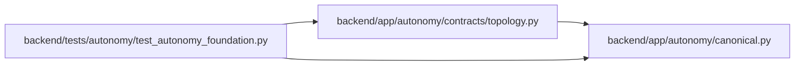

# topology Module

**Path:** `backend/app/autonomy/contracts/topology.py`

## Description

Secret-free agent-team topology and deterministic reconciliation contract.

## Imports

| Source | Symbols |
|--------|---------|
| `__future__` | `annotations` |
| `app.autonomy.canonical` | `StrictContractModel`, `canonical_json_bytes`, `ensure_secret_free`, `sha256_hex` |
| `enum` | `StrEnum` |
| `pydantic` | `Field`, `field_validator`, `model_validator` |
| `typing` | `Any`, `Literal` |

## Local dependency map

<!-- Auto-generated local dependency summary. Do not edit by hand. -->

### Internal neighbors

| Direction | Module |
|---|---|
| Inbound | [test_autonomy_foundation](../modules/test_autonomy_foundation.md) |
| Outbound | [autonomy_canonical](../modules/autonomy_canonical.md) |

### External packages

| Language | Used packages | Undeclared packages |
|---|---:|---:|
| python | 1 | 0 |

## Classes

| Class | Kind | Line | Bases / Target | Description |
|-------|------|------|----------------|-------------|
| [TopologyLifecycleState](../entities/TopologyLifecycleState.md) | Enum | 78 | `StrEnum` | — |
| [ReconciliationClass](../entities/ReconciliationClass.md) | Enum | 88 | `StrEnum` | — |
| [ModelBindingContract](../entities/ModelBindingContract.md) | Pydantic model | 98 | `StrictContractModel` | — |
| [RolePackageContract](../entities/RolePackageContract.md) | Pydantic model | 118 | `StrictContractModel` | — |
| [RuntimeContract](../entities/RuntimeContract.md) | Pydantic model | 124 | `StrictContractModel` | — |
| [TopologyMemberContract](../entities/TopologyMemberContract.md) | Pydantic model | 131 | `StrictContractModel` | — |
| [AgentTeamMasterContract](../entities/AgentTeamMasterContract.md) | Pydantic model | 196 | `StrictContractModel` | Portable desired state for the PostgreSQL PM/worker/verifier topology. |
| [CurrentTopologyMember](../entities/CurrentTopologyMember.md) | Pydantic model | 240 | `StrictContractModel` | — |
| [CurrentTopologySnapshot](../entities/CurrentTopologySnapshot.md) | Pydantic model | 249 | `StrictContractModel` | — |
| [TopologyPlanAction](../entities/TopologyPlanAction.md) | Pydantic model | 256 | `StrictContractModel` | — |
| [AgentTeamReconciliationPlan](../entities/topology_AgentTeamReconciliationPlan.md) | Pydantic model | 268 | `StrictContractModel` | — |

## Functions

| Function | Signature | Decorators | Description |
|----------|-----------|------------|-------------|
| `reconcile_agent_team` | `(desired: AgentTeamMasterContract, current: CurrentTopologySnapshot) -> AgentTeamReconciliationPlan` | — | Derive a stable, redacted plan without mutating topology or credentials. |
| `_redacted_member` | `(member: TopologyMemberContract) -> dict[str, Any]` | — | — |
| `_action` | `(*, desired: AgentTeamMasterContract, logical_key: str, classification: ReconciliationClass, target_revision: int \| None, before: dict[str, Any] \| None, after: dict[str, Any] \| None, blocker_code: str \| None, requires_confirmation: bool) -> TopologyPlanAction` | — | — |
