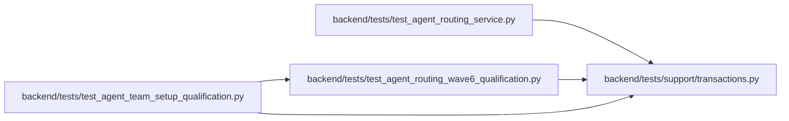

# transactions Module

**Path:** `backend/tests/support/transactions.py`

## Description

Explicit persisted-state reads after rollback in multi-command scenarios.

## Imports

| Source | Symbols |
|--------|---------|
| `sqlalchemy` | `inspect` |

## Local dependency map

<!-- Auto-generated local dependency summary. Do not edit by hand. -->

### Internal neighbors

| Direction | Module |
|---|---|
| Inbound | [test_agent_routing_service](../modules/test_agent_routing_service.md) |
| Inbound | [test_agent_routing_wave6_qualification](../modules/test_agent_routing_wave6_qualification.md) |
| Inbound | [test_agent_team_setup_qualification](../modules/test_agent_team_setup_qualification.md) |

### External packages

| Language | Used packages | Undeclared packages |
|---|---:|---:|
| python | 1 | 0 |

## Functions

| Function | Signature | Decorators | Description |
|----------|-----------|------------|-------------|
| `reload_session_fixture` | *(async)* `(db)` | — | Reload retained fixture objects instead of triggering async lazy I/O in assertions. |
