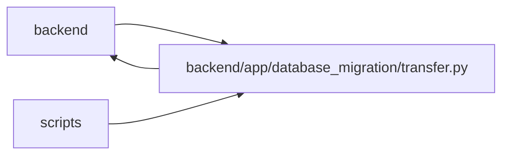

# transfer Module

**Path:** `backend/app/database_migration/transfer.py`

## Description

Catalogued PostgreSQL loading, repairs, and two-phase reconciliation.

## Imports

| Source | Symbols |
|--------|---------|
| `__future__` | `annotations` |
| `app.config` | `get_settings` |
| `app.database_migration.canonical` | `canonical_value`, `digest_rows`, `row_sha256`, `storage_value` |
| `app.database_migration.catalog` | `TRANSFER_CATALOG_VERSION`, `application_tables`, `catalog_entries`, `staged_reference_columns`, `transfer_order`, `transfer_tables` |
| `app.database_migration.manifest` | `ManifestError`, `canonical_json_bytes`, `read_document`, `sha256_bytes`, `verify_document`, `write_document` |
| `app.database_migration.source` | `MigrationDataError`, `_file_sha256`, `_inspect_snapshot`, `_rows`, `read_only_sqlite` |
| `app.models.database_migration` | `DatabaseMigrationGate` |
| `app.services.upgrade_service` | `database_configuration`, `head_revision`, `run_database_repairs` |
| `app.utils.time` | `utc_now` |
| `collections.abc` | `Iterable`, `Iterator`, `Mapping` |
| `contextlib` | `contextmanager` |
| `cryptography.fernet` | `Fernet`, `InvalidToken` |
| `datetime` | `UTC`, `datetime` |
| `hashlib` | `hashlib` |
| `json` | `json` |
| `os` | `os` |
| `pathlib` | `Path` |
| `sqlalchemy` | `and_`, `bindparam`, `create_engine`, `func`, `inspect`, `select`, `text`, `update` |
| `sqlalchemy.engine` | `Connection`, `Engine` |
| `sqlalchemy.pool` | `NullPool` |
| `typing` | `Any` |

## Local dependency map

<!-- Auto-generated local dependency summary. Do not edit by hand. -->

> Module-level dependencies exceed the generated-diagram limits, so the diagram and table below group them by top-level package. Counts report the number of module neighbors in each package.

### Internal neighbors

| Direction | Module |
|---|---|
| Inbound | `backend` (3) |
| Inbound | `scripts` (1) |
| Outbound | `backend` (8) |

### External packages

| Language | Used packages | Undeclared packages |
|---|---:|---:|
| python | 2 | 0 |

> All 12 module neighbor(s) are summarized by package because the module-level view exceeds the 12-node limit.

## Functions

| Function | Signature | Decorators | Description |
|----------|-----------|------------|-------------|
| `_target_engine` | `() -> tuple[Engine, Any]` | — | — |
| `_signed_int32` | `(value: int) -> int` | — | — |
| `_exclusive_loader_connection` | `(engine: Engine) -> Iterator[Connection]` | `@contextmanager` | — |
| `target_identifier` | `(configuration: Any) -> str` | — | Return an exact secret-free target identifier for operator confirmation. |
| `_target_identity_sha256` | `(configuration: Any) -> str` | — | — |
| `_authorize_target` | `(configuration: Any, authorized_target: str) -> str` | — | — |
| `_load_source_manifest` | `(path: Path, snapshot_path: Path) -> dict[str, Any]` | — | — |
| `_optional_evidence` | `(path: Path \| None, *, kind: str, target: str, minimum_bytes: int \| None = None) -> str \| None` | — | — |
| `_assert_postgresql_contract` | `(connection: Connection) -> None` | — | — |
| `_target_rows` | `(connection: Connection, table: Any) -> Iterator[Mapping[str, Any]]` | — | — |
| `_table_count` | `(connection: Connection, table: Any) -> int` | — | — |
| `_gate` | `(connection: Connection, run_id: str) -> Mapping[str, Any] \| None` | — | — |
| `_mark_failed` | `(engine: Engine, run_id: str, code: str) -> None` | — | — |
| `_mark_load_failed` | `(connection: Connection, run_id: str, code: str) -> None` | — | — |
| `_initialize_gate` | `(connection: Connection, *, manifest: Mapping[str, Any], target_identity_sha256: str) -> Mapping[str, Any]` | — | — |
| `_converted_batch` | `(table: Any, rows: Iterable[Mapping[str, Any]], *, staged_columns: set[str]) -> list[dict[str, Any]]` | — | — |
| `_load_table` | `(connection: Connection, source: Any, table: Any, *, chunk_size: int) -> int` | — | — |
| `_restore_staged_references` | `(connection: Connection, source: Any, table: Any, *, chunk_size: int) -> int` | — | — |
| `_repair_sequences` | `(connection: Connection) -> dict[str, Any]` | — | — |
| `load_snapshot` | `(*, snapshot_path: Path, source_manifest_path: Path, report_path: Path, authorized_target: str, capacity_evidence_path: Path \| None = None, loader_method_evidence_path: Path \| None = None, chunk_size: int = 1000, _failure_after_table: str \| None = None) -> dict[str, Any]` | — | Load a catalogued snapshot into an empty, Alembic-current target. |
| `_primary_key_sha256` | `(table: Any, row: Mapping[str, Any]) -> str` | — | — |
| `_row_hash_map` | `(connection: Connection, table: Any) -> dict[str, str]` | — | — |
| `_source_row_hash_map` | `(source: Any, table: Any) -> dict[str, str]` | — | — |
| `_transformations` | `(table_name: str, before: Mapping[str, str], after: Mapping[str, str]) -> list[dict[str, Any]]` | — | — |
| `record_post_copy_repairs` | `(*, source_manifest_path: Path, report_path: Path, authorized_target: str) -> dict[str, Any]` | — | Run the versioned repair catalog and record its exact row-hash delta. |
| `_repair_report` | `(path: Path, *, manifest: Mapping[str, Any], target_identity_sha256: str) -> tuple[str, list[dict[str, Any]]]` | — | — |
| `_sequence_facts` | `(connection: Connection) -> dict[str, Any]` | — | — |
| `_statistics_facts` | `(connection: Connection) -> dict[str, Any]` | — | — |
| `_representative_reads` | `(source: Any, target: Connection) -> dict[str, Any]` | — | — |
| `_decrypt_secret_settings` | `(source: Any, target: Connection, *, encryption_key: str \| None) -> int` | — | — |
| `_raw_table_results` | `(source: Any, target: Connection) -> dict[str, Any]` | — | — |
| `_final_table_results` | `(source: Any, target: Connection, transformations: list[dict[str, Any]]) -> dict[str, Any]` | — | — |
| `reconcile_snapshot` | `(*, snapshot_path: Path, source_manifest_path: Path, report_path: Path, authorized_target: str, phase: str, raw_report_path: Path \| None = None, repair_report_path: Path \| None = None, encryption_key: str \| None = None) -> dict[str, Any]` | — | Reconcile raw or post-repair target state and advance readiness safely. |
