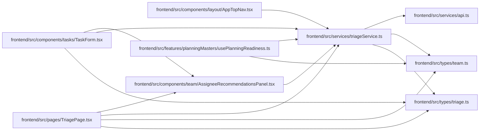

# triageService Module

**Path:** `frontend/src/services/triageService.ts`

## Description

_Auto-generated from `frontend/src/services/triageService.ts`._

## Imports

| Source | Symbols |
|--------|---------|
| `../types/team` | `AssigneeRecommendation` |
| `../types/triage` | `TriageActionRequest`, `TriageClassificationSuggestion`, `TriageConvertToTaskRequest`, `TriageConvertToTaskResponse`, `TriageDuplicateRequest`, `TriageDuplicateSuggestionsResponse`, `TriageItem`, `TriageItemCreate`, `TriageItemUpdate`, `TriageListParams`, `TriageSnoozeRequest`, `TriageTaskDraftRequest`, `TriageTaskDraftResponse` |
| `./api` | `api` |

## Module Signals

| Signal | Values |
|--------|--------|
| Exports | `FrontendTriageService`, `triageService` |
| Constants | `triageService` |

## Local dependency map

<!-- Auto-generated local dependency summary. Do not edit by hand. -->

### Internal neighbors

| Direction | Module |
|---|---|
| Inbound | [AppTopNav](../modules/AppTopNav.md) |
| Inbound | [TaskForm](../modules/TaskForm.md) |
| Inbound | [AssigneeRecommendationsPanel](../modules/AssigneeRecommendationsPanel.md) |
| Inbound | [usePlanningReadiness](../modules/usePlanningReadiness.md) |
| Inbound | [TriagePage](../modules/TriagePage.md) |
| Outbound | [api](../modules/api.md) |
| Outbound | [types_team](../modules/types_team.md) |
| Outbound | [types_triage](../modules/types_triage.md) |

## Classes

| Class | Kind | Line | Bases / Target | Description |
|-------|------|------|----------------|-------------|
| [FrontendTriageService](../entities/FrontendTriageService.md) | Class | 47 | — | — |
