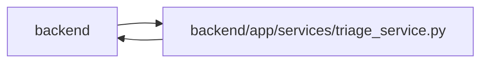

# triage_service Module

**Path:** `backend/app/services/triage_service.py`

## Description

Triage service with inbox, lifecycle, and conversion logic.

Triage retains the legacy iteration-required conversion route and adds an explicit project backlog destination. Structured task drafts are validated, retained with readable derived text and reused only while that text still matches. Conversion preserves canonical criterion identity and applies the destination’s project, owner and capacity checks.

## Imports

| Source | Symbols |
|--------|---------|
| `app.commands` | `commit_or_flush` |
| `app.models.iteration` | `Iteration` |
| `app.models.label` | `LabelGroup` |
| `app.models.project` | `Project` |
| `app.models.task` | `Task` |
| `app.models.team_member` | `TeamMember`, `TeamMemberProfile` |
| `app.models.template` | `TemplateType`, `WorkTemplate` |
| `app.models.triage` | `TriageClassificationSuggestion`, `TriageItem`, `TriageItemStatus` |
| `app.schemas.task` | `TaskCreate` |
| `app.schemas.triage` | `TriageActionRequest`, `TriageClassificationDraft`, `TriageConvertToTaskRequest`, `TriageDuplicateSuggestion`, `TriageDuplicateSuggestionsResponse`, `TriageDuplicateRequest`, `TriageItemCreate`, `TriageItemUpdate`, `TriageSnoozeRequest`, `TriageTaskDraftRequest`, `TriageTaskDraftResponse` |
| `app.services.llm_service` | `LLMService` |
| `app.services.outbound_webhook_service` | `emit_outbound_webhook_event` |
| `app.services.request_source_service` | `RequestSourceService` |
| `app.services.task_service` | `TaskService` |
| `app.sql_semantics` | `portable_contains` |
| `app.utils.text_similarity` | `BM25Similarity`, `SimilarityDocument`, `normalize_text` |
| `app.utils.time` | `as_utc`, `utc_now` |
| `datetime` | `datetime` |
| `json` | `json` |
| `sqlalchemy` | `Select`, `and_`, `case`, `func`, `or_`, `select`, `update` |
| `sqlalchemy.ext.asyncio` | `AsyncSession` |
| `sqlalchemy.orm` | `selectinload` |
| `typing` | `Any`, `Optional`, `Sequence` |

## Local dependency map

<!-- Auto-generated local dependency summary. Do not edit by hand. -->

> Module-level dependencies exceed the generated-diagram limits, so the diagram and table below group them by top-level package. Counts report the number of module neighbors in each package.

### Internal neighbors

| Direction | Module |
|---|---|
| Inbound | `backend` (8) |
| Outbound | `backend` (17) |

### External packages

| Language | Used packages | Undeclared packages |
|---|---:|---:|
| python | 1 | 0 |

> All 25 module neighbor(s) are summarized by package because the module-level view exceeds the 12-node limit.

## Classes

| Class | Line | Bases | Description |
|-------|------|-------|-------------|
| [TriageConflictError](../entities/TriageConflictError.md) | 46 | `Exception` | Raised when a triage action conflicts with current item state. |
| [TriageDraftNotFoundError](../entities/TriageDraftNotFoundError.md) | 50 | `Exception` | Raised when referenced draft context does not exist. |
| [TriageService](../entities/TriageService.md) | 54 | — | Service for triage CRUD, inbox filtering, lifecycle actions, and conversion. |