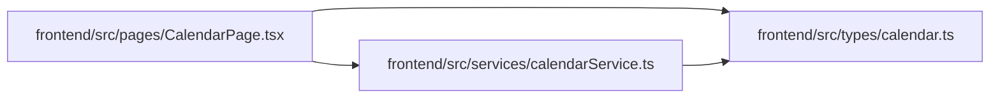

# calendar Module

**Path:** `frontend/src/types/calendar.ts`

## Description

_Auto-generated from `frontend/src/types/calendar.ts`._

## Module Signals

| Signal | Values |
|--------|--------|
| Exports | `Calendar`, `CalendarCreate`, `CalendarImportError`, `CalendarImportResponse`, `CalendarUpdate`, `WorkingDaysResponse` |

## Local dependency map

<!-- Auto-generated local dependency summary. Do not edit by hand. -->

### Internal neighbors

| Direction | Module |
|---|---|
| Inbound | [CalendarPage](../modules/CalendarPage.md) |
| Inbound | [calendarService](../modules/calendarService.md) |

## Classes

| Class | Kind | Line | Bases / Target | Description |
|-------|------|------|----------------|-------------|
| [Calendar](../entities/types_calendar_Calendar.md) | Class | 1 | — | — |
| [CalendarCreate](../entities/types_calendar_CalendarCreate.md) | Class | 11 | — | — |
| [CalendarUpdate](../entities/types_calendar_CalendarUpdate.md) | Class | 19 | — | — |
| [WorkingDaysResponse](../entities/types_calendar_WorkingDaysResponse.md) | Class | 27 | — | — |
| [CalendarImportError](../entities/types_calendar_CalendarImportError.md) | Class | 34 | — | — |
| [CalendarImportResponse](../entities/types_calendar_CalendarImportResponse.md) | Class | 39 | — | — |
