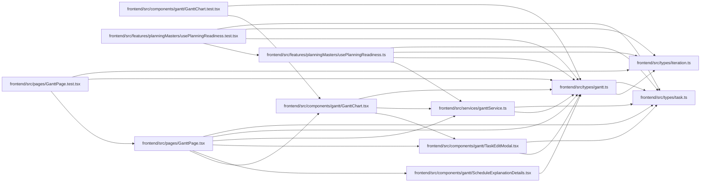

# gantt Module

**Path:** `frontend/src/types/gantt.ts`

## Description

_Auto-generated from `frontend/src/types/gantt.ts`._

## Imports

| Source | Symbols |
|--------|---------|
| `./iteration` | `Iteration` |
| `./task` | `TaskUpdate` |

## Module Signals

| Signal | Values |
|--------|--------|
| Exports | `ExplainScheduleDetailLevel`, `ExplainScheduleRequest`, `ExplainScheduleResponse`, `GanttResponse`, `GanttTask`, `ScheduleDecisionExplanation`, `SchedulePreviewResponse`, `ScheduleResult`, `SchedulingDecision`, `WorkloadAnalysis`, `WorkloadIssue` |

## Local dependency map

<!-- Auto-generated local dependency summary. Do not edit by hand. -->

### Internal neighbors

| Direction | Module |
|---|---|
| Inbound | [GanttChart.test](../modules/GanttChart.test.md) |
| Inbound | [GanttChart](../modules/GanttChart.md) |
| Inbound | [ScheduleExplanationDetails](../modules/ScheduleExplanationDetails.md) |
| Inbound | [TaskEditModal](../modules/TaskEditModal.md) |
| Inbound | [usePlanningReadiness.test](../modules/usePlanningReadiness.test.md) |
| Inbound | [usePlanningReadiness](../modules/usePlanningReadiness.md) |
| Inbound | [GanttPage.test](../modules/GanttPage.test.md) |
| Inbound | [GanttPage](../modules/GanttPage.md) |
| Inbound | [ganttService](../modules/ganttService.md) |
| Outbound | [types_iteration](../modules/types_iteration.md) |
| Outbound | [types_task](../modules/types_task.md) |

## Classes

| Class | Kind | Line | Bases / Target | Description |
|-------|------|------|----------------|-------------|
| [GanttTask](../entities/types_gantt_GanttTask.md) | Class | 6 | — | — |
| [GanttResponse](../entities/types_gantt_GanttResponse.md) | Class | 56 | — | — |
| [ScheduleResult](../entities/types_gantt_ScheduleResult.md) | Class | 66 | — | — |
| [SchedulePreviewResponse](../entities/types_gantt_SchedulePreviewResponse.md) | Class | 76 | — | Server dry-run of sandbox edits through the real scheduler (nothing persisted). |
| [SchedulingDecision](../entities/types_gantt_SchedulingDecision.md) | Class | 84 | — | — |
| [WorkloadIssue](../entities/types_gantt_WorkloadIssue.md) | Class | 92 | — | — |
| [ExplainScheduleRequest](../entities/types_gantt_ExplainScheduleRequest.md) | Class | 100 | — | — |
| [ScheduleDecisionExplanation](../entities/types_gantt_ScheduleDecisionExplanation.md) | Class | 104 | — | — |
| [WorkloadAnalysis](../entities/types_gantt_WorkloadAnalysis.md) | Class | 111 | — | — |
| [ExplainScheduleResponse](../entities/types_gantt_ExplainScheduleResponse.md) | Class | 116 | — | — |
| [ExplainScheduleDetailLevel](../entities/ExplainScheduleDetailLevel.md) | Type alias | 98 | — | — |
