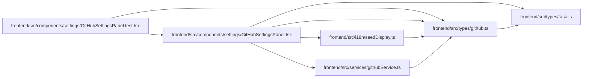

# github Module

**Path:** `frontend/src/types/github.ts`

## Description

_Auto-generated from `frontend/src/types/github.ts`._

## Imports

| Source | Symbols |
|--------|---------|
| `./task` | `TaskStatus` |

## Module Signals

| Signal | Values |
|--------|--------|
| Exports | `GitHubAutomationEventType`, `GitHubAutomationOutcome`, `GitHubAutomationTargetStatus`, `GitHubStatusAutomationResult`, `GitHubStatusAutomationRule`, `GitHubStatusAutomationRuleCreate`, `GitHubStatusAutomationRuleUpdate` |

## Local dependency map

<!-- Auto-generated local dependency summary. Do not edit by hand. -->

### Internal neighbors

| Direction | Module |
|---|---|
| Inbound | [GitHubSettingsPanel.test](../modules/GitHubSettingsPanel.test.md) |
| Inbound | [GitHubSettingsPanel](../modules/GitHubSettingsPanel.md) |
| Inbound | [seedDisplay](../modules/seedDisplay.md) |
| Inbound | [githubService](../modules/githubService.md) |
| Outbound | [types_task](../modules/types_task.md) |

## Classes

| Class | Kind | Line | Bases / Target | Description |
|-------|------|------|----------------|-------------|
| [GitHubStatusAutomationRule](../entities/types_github_GitHubStatusAutomationRule.md) | Class | 14 | — | — |
| [GitHubStatusAutomationRuleCreate](../entities/types_github_GitHubStatusAutomationRuleCreate.md) | Class | 28 | — | — |
| [GitHubStatusAutomationResult](../entities/types_github_GitHubStatusAutomationResult.md) | Class | 41 | — | — |
| [GitHubAutomationEventType](../entities/types_github_GitHubAutomationEventType.md) | Type alias | 3 | — | — |
| [GitHubAutomationTargetStatus](../entities/types_github_GitHubAutomationTargetStatus.md) | Type alias | 11 | — | — |
| [GitHubAutomationOutcome](../entities/types_github_GitHubAutomationOutcome.md) | Type alias | 12 | — | — |
| [GitHubStatusAutomationRuleUpdate](../entities/types_github_GitHubStatusAutomationRuleUpdate.md) | Type alias | 39 | — | — |
