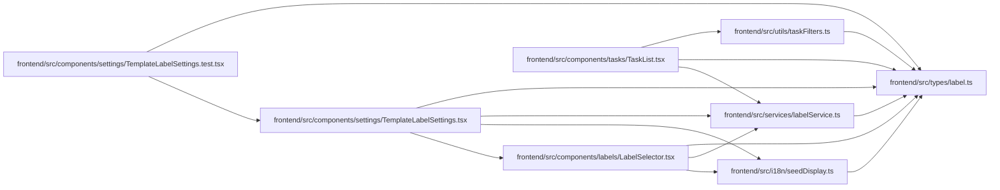

# label Module

**Path:** `frontend/src/types/label.ts`

## Description

_Auto-generated from `frontend/src/types/label.ts`._

## Module Signals

| Signal | Values |
|--------|--------|
| Exports | `Label`, `LabelCreate`, `LabelGroup`, `LabelGroupBrief`, `LabelGroupCreate`, `LabelGroupListParams`, `LabelGroupUpdate`, `LabelListParams`, `LabelUpdate` |

## Local dependency map

<!-- Auto-generated local dependency summary. Do not edit by hand. -->

### Internal neighbors

| Direction | Module |
|---|---|
| Inbound | [LabelSelector](../modules/LabelSelector.md) |
| Inbound | [TemplateLabelSettings.test](../modules/TemplateLabelSettings.test.md) |
| Inbound | [TemplateLabelSettings](../modules/TemplateLabelSettings.md) |
| Inbound | [TaskList](../modules/TaskList.md) |
| Inbound | [seedDisplay](../modules/seedDisplay.md) |
| Inbound | [labelService](../modules/labelService.md) |
| Inbound | [taskFilters](../modules/taskFilters.md) |

## Classes

| Class | Kind | Line | Bases / Target | Description |
|-------|------|------|----------------|-------------|
| [LabelGroupBrief](../entities/types_label_LabelGroupBrief.md) | Class | 1 | — | — |
| [Label](../entities/types_label_Label.md) | Class | 9 | — | — |
| [LabelGroup](../entities/types_label_LabelGroup.md) | Class | 24 | — | — |
| [LabelGroupCreate](../entities/types_label_LabelGroupCreate.md) | Class | 38 | — | — |
| [LabelCreate](../entities/types_label_LabelCreate.md) | Class | 49 | — | — |
| [LabelGroupListParams](../entities/LabelGroupListParams.md) | Class | 61 | — | — |
| [LabelListParams](../entities/LabelListParams.md) | Class | 65 | — | — |
| [LabelGroupUpdate](../entities/types_label_LabelGroupUpdate.md) | Type alias | 47 | — | — |
| [LabelUpdate](../entities/types_label_LabelUpdate.md) | Type alias | 59 | — | — |
