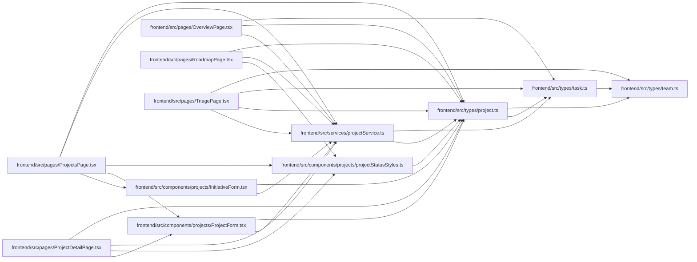

# project Module

**Path:** `frontend/src/types/project.ts`

## Description

_Auto-generated from `frontend/src/types/project.ts`._

## Imports

| Source | Symbols |
|--------|---------|
| `./task` | `Task` |
| `./team` | `TeamMemberOption`, `TeamMemberProfileCompact` |

## Module Signals

| Signal | Values |
|--------|--------|
| Exports | `Initiative`, `InitiativeCreate`, `InitiativeUpdate`, `Project`, `ProjectCreate`, `ProjectHealth`, `ProjectInitiativeSummary`, `ProjectMilestone`, `ProjectMilestoneCreateRequest`, `ProjectMilestoneDeleteResponse`, `ProjectMilestoneStatus`, `ProjectMilestoneSummary`, `ProjectMilestoneTaskGroup`, `ProjectMilestoneUpdateRequest`, `ProjectOwner`, `ProjectPortfolioSummary`, `ProjectProfileOwner`, `ProjectStatus`, `ProjectSummary`, `ProjectTargetDateRisk`, `ProjectTask`, `ProjectUpdate`, `ProjectUpdateEntry`, `ProjectUpdateEntryCreate`, `ProjectUpdateFreshness`, `RoadmapMilestonePage` |

## Local dependency map

<!-- Auto-generated local dependency summary. Do not edit by hand. -->

### Internal neighbors

| Direction | Module |
|---|---|
| Inbound | [InitiativeForm](../modules/InitiativeForm.md) |
| Inbound | [ProjectForm](../modules/ProjectForm.md) |
| Inbound | [projectStatusStyles](../modules/projectStatusStyles.md) |
| Inbound | [OverviewPage](../modules/OverviewPage.md) |
| Inbound | [ProjectDetailPage](../modules/ProjectDetailPage.md) |
| Inbound | [ProjectsPage](../modules/ProjectsPage.md) |
| Inbound | [RoadmapPage](../modules/RoadmapPage.md) |
| Inbound | [TriagePage](../modules/TriagePage.md) |
| Inbound | [projectService](../modules/projectService.md) |
| Outbound | [types_task](../modules/types_task.md) |
| Outbound | [types_team](../modules/types_team.md) |

## Classes

| Class | Kind | Line | Bases / Target | Description |
|-------|------|------|----------------|-------------|
| [Initiative](../entities/types_project_Initiative.md) | Class | 12 | — | — |
| [InitiativeCreate](../entities/types_project_InitiativeCreate.md) | Class | 26 | — | — |
| [InitiativeUpdate](../entities/types_project_InitiativeUpdate.md) | Class | 35 | — | — |
| [ProjectInitiativeSummary](../entities/types_project_ProjectInitiativeSummary.md) | Class | 44 | — | — |
| [Project](../entities/types_project_Project.md) | Class | 55 | — | — |
| [ProjectCreate](../entities/types_project_ProjectCreate.md) | Class | 75 | — | — |
| [ProjectUpdate](../entities/types_project_ProjectUpdate.md) | Class | 88 | — | — |
| [ProjectUpdateEntry](../entities/types_project_ProjectUpdateEntry.md) | Class | 102 | — | — |
| [ProjectUpdateEntryCreate](../entities/types_project_ProjectUpdateEntryCreate.md) | Class | 115 | — | — |
| [ProjectMilestone](../entities/types_project_ProjectMilestone.md) | Class | 124 | — | — |
| [RoadmapMilestonePage](../entities/types_project_RoadmapMilestonePage.md) | Class | 137 | — | — |
| [ProjectMilestoneCreateRequest](../entities/types_project_ProjectMilestoneCreateRequest.md) | Class | 142 | — | — |
| [ProjectMilestoneUpdateRequest](../entities/ProjectMilestoneUpdateRequest.md) | Class | 151 | — | — |
| [ProjectMilestoneDeleteResponse](../entities/types_project_ProjectMilestoneDeleteResponse.md) | Class | 160 | — | — |
| [ProjectMilestoneSummary](../entities/types_project_ProjectMilestoneSummary.md) | Class | 166 | — | — |
| [ProjectMilestoneTaskGroup](../entities/types_project_ProjectMilestoneTaskGroup.md) | Class | 175 | — | — |
| [ProjectPortfolioSummary](../entities/types_project_ProjectPortfolioSummary.md) | Class | 187 | — | — |
| [ProjectSummary](../entities/types_project_ProjectSummary.md) | Class | 198 | — | — |
| [ProjectStatus](../entities/types_project_ProjectStatus.md) | Type alias | 4 | — | — |
| [ProjectHealth](../entities/types_project_ProjectHealth.md) | Type alias | 5 | — | — |
| [ProjectTargetDateRisk](../entities/types_project_ProjectTargetDateRisk.md) | Type alias | 6 | — | — |
| [ProjectUpdateFreshness](../entities/types_project_ProjectUpdateFreshness.md) | Type alias | 7 | — | — |
| [ProjectMilestoneStatus](../entities/types_project_ProjectMilestoneStatus.md) | Type alias | 8 | — | — |
| [ProjectOwner](../entities/ProjectOwner.md) | Type alias | 9 | — | — |
| [ProjectProfileOwner](../entities/ProjectProfileOwner.md) | Type alias | 10 | — | — |
| [ProjectTask](../entities/ProjectTask.md) | Type alias | 236 | — | — |
