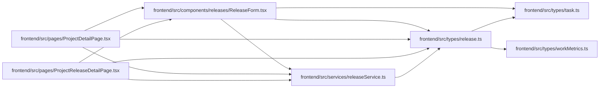

# release Module

**Path:** `frontend/src/types/release.ts`

## Description

_Auto-generated from `frontend/src/types/release.ts`._

## Imports

| Source | Symbols |
|--------|---------|
| `./task` | `TaskStatus` |
| `./workMetrics` | `WorkMetrics` |

## Module Signals

| Signal | Values |
|--------|--------|
| Exports | `Release`, `ReleaseCreateRequest`, `ReleaseStatus`, `ReleaseTaskSummary`, `ReleaseUpdateRequest` |

## Local dependency map

<!-- Auto-generated local dependency summary. Do not edit by hand. -->

### Internal neighbors

| Direction | Module |
|---|---|
| Inbound | [ReleaseForm](../modules/ReleaseForm.md) |
| Inbound | [ProjectDetailPage](../modules/ProjectDetailPage.md) |
| Inbound | [ProjectReleaseDetailPage](../modules/ProjectReleaseDetailPage.md) |
| Inbound | [releaseService](../modules/releaseService.md) |
| Outbound | [types_task](../modules/types_task.md) |
| Outbound | [workMetrics](../modules/workMetrics.md) |

## Classes

| Class | Kind | Line | Bases / Target | Description |
|-------|------|------|----------------|-------------|
| [ReleaseTaskSummary](../entities/types_release_ReleaseTaskSummary.md) | Class | 6 | — | — |
| [Release](../entities/types_release_Release.md) | Class | 13 | `WorkMetrics` | — |
| [ReleaseCreateRequest](../entities/types_release_ReleaseCreateRequest.md) | Class | 29 | — | — |
| [ReleaseUpdateRequest](../entities/types_release_ReleaseUpdateRequest.md) | Class | 40 | — | — |
| [ReleaseStatus](../entities/types_release_ReleaseStatus.md) | Type alias | 4 | — | — |
