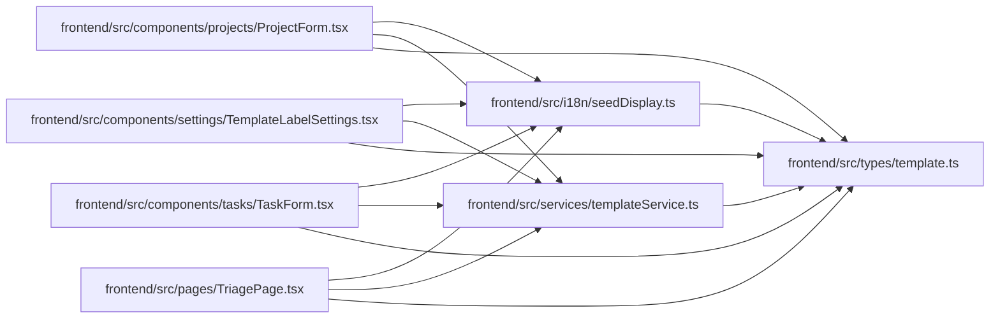

# template Module

**Path:** `frontend/src/types/template.ts`

## Description

_Auto-generated from `frontend/src/types/template.ts`._

## Module Signals

| Signal | Values |
|--------|--------|
| Exports | `TemplateListParams`, `TemplateType`, `WorkTemplate`, `WorkTemplateCreate`, `WorkTemplateUpdate` |

## Local dependency map

<!-- Auto-generated local dependency summary. Do not edit by hand. -->

### Internal neighbors

| Direction | Module |
|---|---|
| Inbound | [ProjectForm](../modules/ProjectForm.md) |
| Inbound | [TemplateLabelSettings](../modules/TemplateLabelSettings.md) |
| Inbound | [TaskForm](../modules/TaskForm.md) |
| Inbound | [seedDisplay](../modules/seedDisplay.md) |
| Inbound | [TriagePage](../modules/TriagePage.md) |
| Inbound | [templateService](../modules/templateService.md) |

## Classes

| Class | Kind | Line | Bases / Target | Description |
|-------|------|------|----------------|-------------|
| [WorkTemplate](../entities/types_template_WorkTemplate.md) | Class | 3 | — | — |
| [WorkTemplateCreate](../entities/types_template_WorkTemplateCreate.md) | Class | 22 | — | — |
| [TemplateListParams](../entities/TemplateListParams.md) | Class | 39 | — | — |
| [TemplateType](../entities/types_template_TemplateType.md) | Type alias | 1 | — | — |
| [WorkTemplateUpdate](../entities/types_template_WorkTemplateUpdate.md) | Type alias | 37 | — | — |
