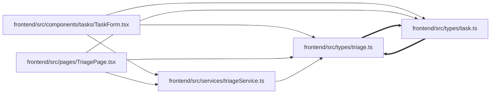

# triage Module

**Path:** `frontend/src/types/triage.ts`

## Description

_Auto-generated from `frontend/src/types/triage.ts`._

## Imports

| Source | Symbols |
|--------|---------|
| `./task` | `TaskBrief`, `Task` |

## Module Signals

| Signal | Values |
|--------|--------|
| Exports | `TriageActionRequest`, `TriageClassificationSuggestion`, `TriageConvertToTaskRequest`, `TriageConvertToTaskResponse`, `TriageDuplicateRequest`, `TriageDuplicateSuggestion`, `TriageDuplicateSuggestionsResponse`, `TriageItem`, `TriageItemCreate`, `TriageItemStatus`, `TriageItemUpdate`, `TriageListParams`, `TriageSnoozeRequest`, `TriageTaskDraftRequest`, `TriageTaskDraftResponse` |

## Local dependency map

<!-- Auto-generated local dependency summary. Do not edit by hand. -->
<!-- Thick arrows (==>) mark edges inside an import cycle. -->

### Internal neighbors

| Direction | Module |
|---|---|
| Inbound | [TaskForm](../modules/TaskForm.md) |
| Inbound | [TriagePage](../modules/TriagePage.md) |
| Inbound | [triageService](../modules/triageService.md) |
| Inbound | [types_task](../modules/types_task.md) |
| Outbound | [types_task](../modules/types_task.md) |

## Classes

| Class | Kind | Line | Bases / Target | Description |
|-------|------|------|----------------|-------------|
| [TriageItem](../entities/types_triage_TriageItem.md) | Class | 6 | — | — |
| [TriageItemCreate](../entities/types_triage_TriageItemCreate.md) | Class | 30 | — | — |
| [TriageListParams](../entities/TriageListParams.md) | Class | 46 | — | — |
| [TriageActionRequest](../entities/types_triage_TriageActionRequest.md) | Class | 55 | — | — |
| [TriageSnoozeRequest](../entities/types_triage_TriageSnoozeRequest.md) | Class | 59 | — | — |
| [TriageDuplicateRequest](../entities/types_triage_TriageDuplicateRequest.md) | Class | 64 | — | — |
| [TriageDuplicateSuggestion](../entities/types_triage_TriageDuplicateSuggestion.md) | Class | 71 | — | — |
| [TriageDuplicateSuggestionsResponse](../entities/types_triage_TriageDuplicateSuggestionsResponse.md) | Class | 87 | — | — |
| [TriageClassificationSuggestion](../entities/types_triage_TriageClassificationSuggestion.md) | Class | 93 | — | — |
| [TriageTaskDraftRequest](../entities/types_triage_TriageTaskDraftRequest.md) | Class | 114 | — | — |
| [TriageTaskDraftResponse](../entities/types_triage_TriageTaskDraftResponse.md) | Class | 121 | — | — |
| [TriageConvertToTaskRequest](../entities/types_triage_TriageConvertToTaskRequest.md) | Class | 145 | — | — |
| [TriageConvertToTaskResponse](../entities/types_triage_TriageConvertToTaskResponse.md) | Class | 160 | — | — |
| [TriageItemStatus](../entities/types_triage_TriageItemStatus.md) | Type alias | 4 | — | — |
| [TriageItemUpdate](../entities/types_triage_TriageItemUpdate.md) | Type alias | 44 | — | — |
