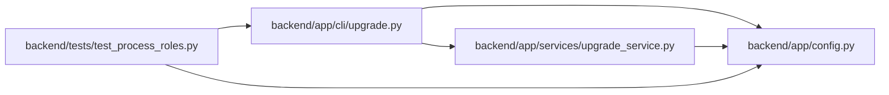

# upgrade Module

**Path:** `backend/app/cli/upgrade.py`

## Description

Operational database upgrade command.

## Imports

| Source | Symbols |
|--------|---------|
| `__future__` | `annotations` |
| `app.config` | `get_settings` |
| `app.services.upgrade_service` | `UpgradeError`, `bootstrap_database_schema`, `inspect_database`, `run_alembic_upgrade`, `run_database_repairs` |
| `argparse` | `argparse` |
| `pathlib` | `Path` |
| `sys` | `sys` |

## Local dependency map

<!-- Auto-generated local dependency summary. Do not edit by hand. -->

### Internal neighbors

| Direction | Module |
|---|---|
| Inbound | [test_process_roles](../modules/test_process_roles.md) |
| Outbound | [config](../modules/config.md) |
| Outbound | [upgrade_service](../modules/upgrade_service.md) |

## Functions

| Function | Signature | Decorators | Description |
|----------|-----------|------------|-------------|
| `_print_status` | `(prefix: str) -> None` | — | — |
| `build_parser` | `() -> argparse.ArgumentParser` | — | Build the CLI argument parser. |
| `main` | `(argv: list[str] \| None = None) -> int` | — | Run the upgrade command. |
