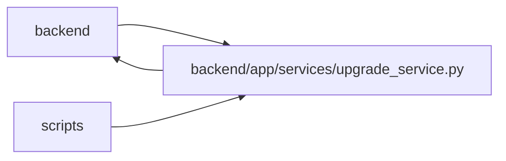

# upgrade_service Module

**Path:** `backend/app/services/upgrade_service.py`

## Description

Database upgrade and schema-version helpers.

Empty databases apply the frozen initial schema. Managed databases must name a revision in the packaged Alembic chain; nonempty unversioned databases and revisions from older unreleased builds are refused before mutation. Table names alone never authorize stamping. Operators preserve any needed development data and select a new empty database for initialization.

PostgreSQL runners serialize through a session advisory lock. Future nonempty PostgreSQL upgrades retain the external backup/PITR gate. Schema-only bootstrap creates no application rows; explicit repair owns control-plane and default-data initialization. API startup only checks the current revision.

## Imports

| Source | Symbols |
|--------|---------|
| `__future__` | `annotations` |
| `alembic` | `command` |
| `alembic.config` | `Config` |
| `alembic.script` | `ScriptDirectory` |
| `app.commands` | `commit_or_flush` |
| `app.config` | `get_settings` |
| `app.database` | `async_session_maker` |
| `app.database_config` | `DatabaseConfiguration`, `alembic_safe_url`, `parse_database_configuration` |
| `app.maintenance` | `require_background_writes_enabled` |
| `app.services.calendar_service` | `CalendarService` |
| `app.services.github_status_automation_service` | `GitHubStatusAutomationService` |
| `app.services.identity_service` | `initialize_control_plane` |
| `app.services.label_service` | `LabelService` |
| `app.services.saved_view_service` | `SavedViewService` |
| `app.services.system_settings_service` | `RuntimeSettingsService` |
| `app.services.template_service` | `TemplateService` |
| `asyncio` | `asyncio` |
| `contextlib` | `contextmanager` |
| `dataclasses` | `dataclass` |
| `datetime` | `UTC`, `datetime` |
| `pathlib` | `Path` |
| `shutil` | `shutil` |
| `sqlalchemy` | `create_engine`, `inspect`, `text` |
| `sqlalchemy.engine` | `Connection`, `Engine` |
| `sqlalchemy.pool` | `NullPool` |
| `typing` | `Iterator`, `Literal`, `Optional` |

## Local dependency map

<!-- Auto-generated local dependency summary. Do not edit by hand. -->

> Module-level dependencies exceed the generated-diagram limits, so the diagram and table below group them by top-level package. Counts report the number of module neighbors in each package.

### Internal neighbors

| Direction | Module |
|---|---|
| Inbound | `backend` (17) |
| Inbound | `scripts` (3) |
| Outbound | `backend` (12) |

### External packages

| Language | Used packages | Undeclared packages |
|---|---:|---:|
| python | 2 | 0 |

> All 31 module neighbor(s) are summarized by package because the module-level view exceeds the 12-node limit.

## Classes

| Class | Kind | Line | Bases / Target | Description |
|-------|------|------|----------------|-------------|
| [DatabaseState](../entities/DatabaseState.md) | Type alias | 31 | `Literal['empty', 'alembic_managed', 'unknown']` | — |
| [UpgradeError](../entities/UpgradeError.md) | Class | 34 | `RuntimeError` | Raised when a database cannot be upgraded safely. |
| [DatabaseStatus](../entities/DatabaseStatus.md) | Class | 39 | — | Inspected database schema state. |

## Functions

| Function | Signature | Decorators | Description |
|----------|-----------|------------|-------------|
| `migrations_dir` | `() -> Path` | — | Return the packaged Alembic migration directory. |
| `database_configuration` | `() -> DatabaseConfiguration` | — | Return the shared validated database configuration. |
| `alembic_config` | `(*, connection: Connection \| None = None) -> Config` | — | Build an Alembic config independent of the caller's cwd. |
| `sync_database_url` | `() -> str` | — | Return a sync SQLAlchemy URL for Alembic/schema inspection. |
| `head_revision` | `() -> str` | — | Return the single Alembic head revision. |
| `_sync_engine` | `(configuration: DatabaseConfiguration \| None = None) -> Engine` | — | — |
| `_current_revision` | `(connection: Connection) -> Optional[str]` | — | — |
| `_inspect_database_connection` | `(connection: Connection) -> DatabaseStatus` | — | — |
| `inspect_database` | `(*, connection: Connection \| None = None) -> DatabaseStatus` | — | Classify the configured database without mutating it. |
| `sqlite_database_path` | `() -> Optional[Path]` | — | Return the configured SQLite database path, if applicable. |
| `backup_sqlite_database` | `(backup_dir: Optional[Path] = None) -> Optional[Path]` | — | Create a timestamped SQLite backup and return its path. |
| `run_post_migration_repairs` | *(async)* `() -> None` | — | Run idempotent seeders and compatibility repairs after migrations. |
| `migration_connection` | `() -> Iterator[Connection]` | `@contextmanager` | Yield one NullPool connection holding the cross-runner migration lock. |
| `_validate_managed_revision` | `(status: DatabaseStatus) -> None` | — | — |
| `_application_tables_with_rows` | `(connection: Connection) -> list[str]` | — | — |
| `_backup_precondition` | `(*, before: DatabaseStatus, backup: bool, backup_dir: Optional[Path], external_backup_reference: str \| None) -> Optional[Path]` | — | — |
| `_run_schema_upgrade` | `(connection: Connection) -> None` | — | — |
| `run_alembic_upgrade` | `(*, backup: bool = True, backup_dir: Optional[Path] = None, run_repairs: bool = True, external_backup_reference: str \| None = None, require_empty: bool = False) -> tuple[DatabaseStatus, Optional[Path], DatabaseStatus]` | — | Upgrade the configured database to the current Alembic head. |
| `bootstrap_database_schema` | `() -> tuple[DatabaseStatus, None, DatabaseStatus]` | — | Migrate an empty target without creating application-owned rows. |
| `run_database_repairs` | `() -> tuple[DatabaseStatus, DatabaseStatus]` | — | Run serialized post-copy seed/compatibility repairs on a current schema. |
| `assert_database_current` | `() -> None` | — | Raise a clear error when the app database is not Alembic-current. |
