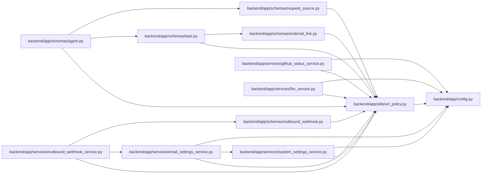

# url_policy Module

**Path:** `backend/app/utils/url_policy.py`

## Description

Centralized outbound URL and host validation.

## Imports

| Source | Symbols |
|--------|---------|
| `__future__` | `annotations` |
| `app.config` | `get_settings` |
| `ipaddress` | `ipaddress` |
| `socket` | `socket` |
| `urllib.parse` | `urlparse` |

## Local dependency map

<!-- Auto-generated local dependency summary. Do not edit by hand. -->

### Internal neighbors

| Direction | Module |
|---|---|
| Inbound | [schemas_agent](../modules/schemas_agent.md) |
| Inbound | [schemas_external_link](../modules/schemas_external_link.md) |
| Inbound | [schemas_outbound_webhook](../modules/schemas_outbound_webhook.md) |
| Inbound | [schemas_request_source](../modules/schemas_request_source.md) |
| Inbound | [schemas_task](../modules/schemas_task.md) |
| Inbound | [email_settings_service](../modules/email_settings_service.md) |
| Inbound | [github_status_service](../modules/github_status_service.md) |
| Inbound | [llm_service](../modules/llm_service.md) |
| Inbound | [outbound_webhook_service](../modules/outbound_webhook_service.md) |
| Inbound | [system_settings_service](../modules/system_settings_service.md) |
| Outbound | [config](../modules/config.md) |

## Classes

| Class | Line | Bases | Description |
|-------|------|-------|-------------|
| [URLPolicyError](../entities/URLPolicyError.md) | 14 | `ValueError` | Raised when a URL or host violates outbound egress policy. |

## Functions

| Function | Signature | Decorators | Description |
|----------|-----------|------------|-------------|
| `_is_blocked_ip` | `(ip: IPAddress) -> bool` | — | — |
| `_literal_ip` | `(host: str) -> IPAddress \| None` | — | — |
| `_host_looks_local` | `(host: str) -> bool` | — | — |
| `validate_public_host` | `(host: str, *, allow_private: bool = False, resolve: bool = True) -> str` | — | Validate a hostname or IP literal for outbound network use. |
| `normalize_external_http_url` | `(value: str, *, require_https: bool = False, allow_http_localhost: bool = False, allow_http_private: bool = False, resolve: bool = True) -> str` | — | Normalize and validate an outbound HTTP(S) URL. |
| `normalize_provider_api_url` | `(value: str) -> str` | — | Validate a provider API URL that may carry credentials in headers. |
| `normalize_stored_display_url` | `(value: str) -> str` | — | Validate externally displayed user-supplied links before persistence. |
