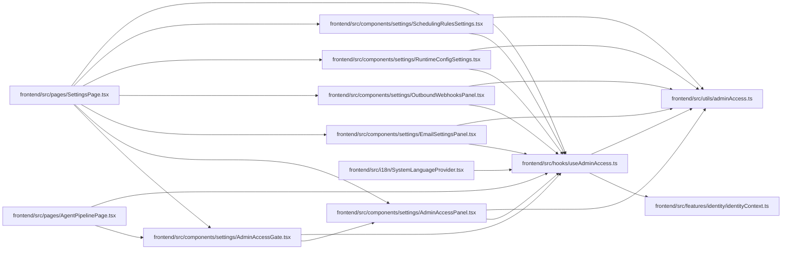

# useAdminAccess Module

**Path:** `frontend/src/hooks/useAdminAccess.ts`

## Description

_Auto-generated from `frontend/src/hooks/useAdminAccess.ts`._

## Imports

| Source | Symbols |
|--------|---------|
| `../features/identity/identityContext` | `useIdentity` |
| `../utils/adminAccess` | `ADMIN_API_KEY_CHANGED_EVENT`, `hasAdminApiKey` |
| `react` | `useEffect`, `useState` |

## Module Signals

| Signal | Values |
|--------|--------|
| Exports | `useAdminAccess` |

## Local dependency map

<!-- Auto-generated local dependency summary. Do not edit by hand. -->

### Internal neighbors

| Direction | Module |
|---|---|
| Inbound | [AdminAccessGate](../modules/AdminAccessGate.md) |
| Inbound | [AdminAccessPanel](../modules/AdminAccessPanel.md) |
| Inbound | [EmailSettingsPanel](../modules/EmailSettingsPanel.md) |
| Inbound | [OutboundWebhooksPanel](../modules/OutboundWebhooksPanel.md) |
| Inbound | [RuntimeConfigSettings](../modules/RuntimeConfigSettings.md) |
| Inbound | [SchedulingRulesSettings](../modules/SchedulingRulesSettings.md) |
| Inbound | [SystemLanguageProvider](../modules/SystemLanguageProvider.md) |
| Inbound | [AgentPipelinePage](../modules/AgentPipelinePage.md) |
| Inbound | [SettingsPage](../modules/SettingsPage.md) |
| Outbound | [identityContext](../modules/identityContext.md) |
| Outbound | [adminAccess](../modules/adminAccess.md) |

### External packages

| Language | Used packages | Undeclared packages |
|---|---:|---:|
| typescript | 1 | 0 |

## Functions

| Function | Signature | Decorators | Description |
|----------|-----------|------------|-------------|
| `useAdminAccess` | `()` | — | — |
