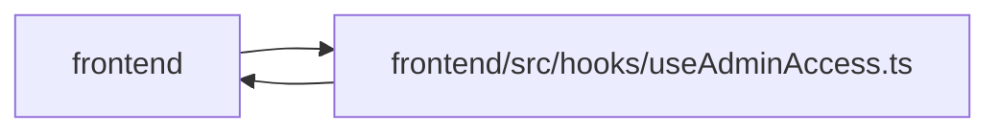

# useAdminAccess Module

**Path:** `frontend/src/hooks/useAdminAccess.ts`

## Description

_Auto-generated from `frontend/src/hooks/useAdminAccess.ts`._

## Imports

| Source | Symbols |
|--------|---------|
| `../features/identity/identityContext` | `useIdentity` |
| `../utils/adminAccess` | `ADMIN_API_KEY_CHANGED_EVENT`, `hasAdminApiKey` |
| `react` | `useEffect`, `useState` |

## Module Signals

| Signal | Values |
|--------|--------|
| Exports | `useAdminAccess` |

## Local dependency map

<!-- Auto-generated local dependency summary. Do not edit by hand. -->

> Module-level dependencies exceed the generated-diagram limits, so the diagram and table below group them by top-level package. Counts report the number of module neighbors in each package.

### Internal neighbors

| Direction | Module |
|---|---|
| Inbound | `frontend` (10) |
| Outbound | `frontend` (2) |

### External packages

| Language | Used packages | Undeclared packages |
|---|---:|---:|
| typescript | 1 | 0 |

> All 12 module neighbor(s) are summarized by package because the module-level view exceeds the 12-node limit.

## Functions

| Function | Signature | Decorators | Description |
|----------|-----------|------------|-------------|
| `useAdminAccess` | `()` | — | — |
